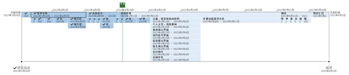
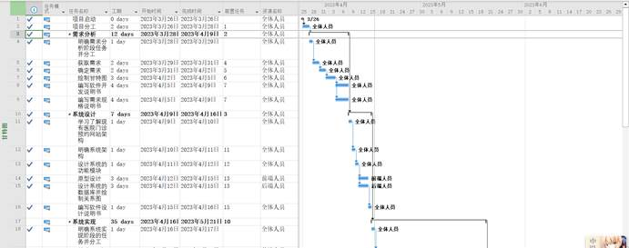
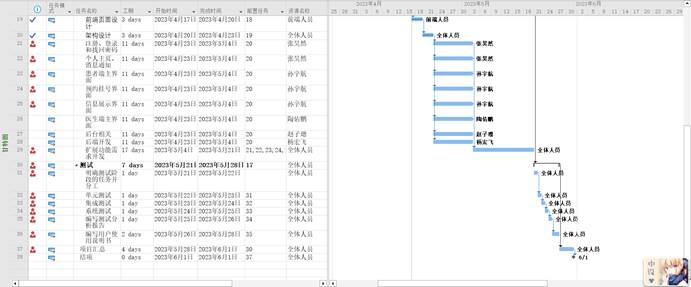

# **医院门诊预约系统**

**[软件开发计划书]**

| 成员 | 杨宏飞 |
| ---- | ------ |
| 成员 | 赵子璁 |
| 成员 | 陶佑鹏 |
| 成员 | 张昊然 |
| 成员 | 孙宇航 |

- [**医院门诊预约系统**](#医院门诊预约系统)
- [1.  引言](#1--引言)
  - [1.1   背景](#11---背景)
  - [1.2   目的](#12---目的)
  - [1.3   参考资料](#13---参考资料)
  - [1.4 相关文档](#14-相关文档)
  - [1.5 涉及名词](#15-涉及名词)
- [2. 项目概述](#2-项目概述)
  - [2.1 项目目标](#21-项目目标)
  - [2.2 项目范围](#22-项目范围)
  - [2.3   项目使用对象](#23---项目使用对象)
  - [2.4   需要交付的成果](#24---需要交付的成果)
    - [2.4.1  需要交付的软件](#241--需要交付的软件)
    - [2.4.2  需要交付的文档](#242--需要交付的文档)
- [3. 组织安排](#3-组织安排)
  - [3.1 组织结构](#31-组织结构)
  - [3.2 成员分工](#32-成员分工)
  - [3.3.协作与沟通](#33协作与沟通)
    - [3.3.1.协作沟通对象](#331协作沟通对象)
    - [3.3.2.沟通方式](#332沟通方式)
    - [3.3.3.协作模式](#333协作模式)
- [4.实施计划](#4实施计划)
  - [4.1.风险评估](#41风险评估)
  - [4.2.工作流程及任务分解](#42工作流程及任务分解)
  - [4.3.进度安排](#43进度安排)
  - [4.4.项目控制计划](#44项目控制计划)
    - [4.4.1.技术风险控制](#441技术风险控制)
    - [4.4.2.进度风险控制](#442进度风险控制)
- [5.支持条件](#5支持条件)
  - [5.1.硬件及软件支持](#51硬件及软件支持)
    - [5.1.1.硬件支持](#511硬件支持)
    - [5.1.2.软件支持](#512软件支持)
  - [5.2.用户支持](#52用户支持)
- [6.预算评估](#6预算评估)
  - [6.1.人员成本](#61人员成本)
  - [6.2.设备成本](#62设备成本)
  - [6.3.软件成本](#63软件成本)
- [7.关键问题分析](#7关键问题分析)
  - [7.1 用户体验](#71-用户体验)
    - [7.1.1 提高交互的舒适感](#711-提高交互的舒适感)
    - [7.1.2 提高交互的流畅感](#712-提高交互的流畅感)
    - [7.1.3 提高交互的简洁性](#713-提高交互的简洁性)
- [8.专题计划要点](#8专题计划要点)
  - [8.1 项目学习计划](#81-项目学习计划)
  - [8.2 项目测试计划](#82-项目测试计划)
  - [8.3 质量保证计划](#83-质量保证计划)
  - [8.4 安全保密计划](#84-安全保密计划)
  - [8.5 学习总结计划](#85-学习总结计划)

# 1. 引言

## 1.1   背景

随着社会的发展和人口的增长，医疗需求日益增加，导致了医院门诊人流量大，排队时间长，挂号难等问题，给医院和患者带来了不便和困扰。与此同时，互联网技术的普及与发展，人们对网上挂号的期待也愈发提高。

为了解决以上问题，方便患者预约医院的门诊号，同时减轻医院工作人员的工作量，本公司决定开发一个线上的医院门诊预约系统。这个系统旨在替换传统的当场取号和电话预约，让患者能在线上提前预约门诊号，同时方便医生查看当日的患者信息，也便于医院安排门诊排班。

## 1.2   目的

为了保证项目团队按时保质地完成项目目标，也便于项目团队成员更好地了解项目情况，使项目工作开展的各个过程合理有序，有必要以文件化的形式，把对于在项目生命周期内的工作任务范围、各项工作的任务分解、项目团队组织结构、各团队成员的工作责任、团队内外沟通协作方式、开发进度、经费预算、项目内外环境条件、风险对策等内容以书面形式描述出来，作为项目团队成员以及项目干系人之间的共识与约定，项目生命周期内所有项目活动的行动基础，项目团队开展和检查项目工作的依据。

此计划书不仅能让参与项目的开发者们知道项目如何进行，还明确了他们各自的职责、保证项目团队之间的协作更加有条不紊、使得项目工作的各个过程能够合理有序地进行。同时，计划书也能在团队内外的沟通中起着向导作用，对团队之间的工作范围、开发模块之间的关系，以及对开发进度、经费预算、分配人力物理、风险等因素进行了大概的描述。

本项目开发计划用于从总体上指导“hms”医院门诊预约系统的开发，并最终得到满足需求的项目产品。本项目开发计划面向用户，项目监督人员，项目开发者。

## 1.3   参考资料

[1] 吕云翔. 软件工程实用教程[M]. 北京：清华大学出版社, 2015.

## 1.4 相关文档

[1] 《需求规格说明书》

[2] 《软件设计说明书》

[3] 《部署文档》

[4] 《测试报告》

[5] 《用户使用说明书》

## 1.5 涉及名词

本平台（本系统、本项目、本网站、hms）：代表此项目最终的成品。

用户（所有用户）：代表使用本产品的用户，包括患者、医生与管理员。

# 2. 项目概述

## 2.1 项目目标

以实现所有基础需求为保证、以进一步提高用户体验为拓展，我们提出目标：

1.  保证平台基础功能正常运行。

2. 保证平台信息的私密性和安全性。

3. 保证平台操作的便利性和流畅性。

4. 适当拓展额外功能与特性，以给用户提供更全面、更个性化的服务。

实现以上几个目标，便能确保平台满足需求。

## 2.2 项目范围

本节主要依照《需求规格说明书》的相关章节来说明我们这一部分的一些设计范围。

1. 功能模块列表

**表** **2-1** 功能模块列表

| **编号** | **名称**             | **模块功能描述**                                             |
| -------- | -------------------- | ------------------------------------------------------------ |
| 1        | 注册登录个人信息模块 | 未注册用户（包括患者和医生）想要使用本系统除浏览以外的功能时，会执行注册操作；已注册用户在使用相关功能前，会执行登录操作。其中医生账号注册需管理员审核。管理员账号直接添加到数据库，无法注册。已登录用户（除管理员）可查看个人信息 |
| 2        | 消息通知             | 用户可在消息通知界面查看消息。包括预约成功的提醒等。         |
| 3        | 医生端模块           | 医生在登录操作完成之后，会进入医生端主界面。在主界面可以查看科室/医生信息、挂号信息以及进行预约挂号。 |
| 4        | 查看医生信息模块     | 患者端可查看医生信息。                                       |
| 5        | 预约挂号模块         | 患者可在预约挂号界面进行预约。                               |
| 6        | 我的预约模块         | 患者可查看自己的预约信息。                                   |
| 7        | 后台管理模块         | 管理员在登录操作完成之后，会进入后台主机面。在主界面可以管理与修改科室/医生信息、排班信息。 |

2. 性能需求列表

**表** **2-2** 性能需求列表

| 编号 | 性能需求来源名称 | 使用者 | 功能描述                         | 响应要求 | 结果                                 |
| ---- | ---------------- | ------ | -------------------------------- | -------- | ------------------------------------ |
| 1    | 加载消息         | 用户   | 用户获取外界发给他的信息         | 0.5s     | 用户收到消息                         |
| 2    | 个人信息编辑     | 用户   | 用户对于信息进行必要的补充和修改 | 0.5s     | 用户的信息得到更新并且数据库得到更新 |
| 3    | 用户登录注册     | 用户   | 用户实现登陆的功能               | 0.5s     | 用户成功登录到系统或者成功注册账号   |
| 4    | 查找患者信息     | 医生  | 点击患者信息后查找对应患者的个人信息页面               | 0.5s     | 跳转到对应患者个人信息页面   |
| 5   | 检索科室或医生信息  | 管理员   | 在修改信息前，管理员需获取原有信息  | 0.5s     | 管理员收到旧的科室或医生信息                         |

## 2.3   项目使用对象

本平台的实际使用者为有意愿使用本网站的医院的医生、管理员及其患者。

## 2.4   需要交付的成果

### 2.4.1  需要交付的软件

最终形式为一个网站，结合了用户交互的前端界面，和提供业务逻辑操纵接口的后端系统。

### 2.4.2  需要交付的文档

预计包括以下8个文件：

1.《软件开发计划书》

2.《需求规格说明书》

3.《软件设计说明书》

4.《软件实现说明书》

5.《测试报告》

6.《部署文档》

7.《用户使用说明书》

8.《项目总结表》

# 3. 组织安排

## 3.1 组织结构

由五名软件学院的学生组成，各成员基本信息如下：

表3-1 成员基本信息表

| 姓名   | 班级   | 学号     |
| ------ | ------ | -------- |
| 杨宏飞 | 212115 | 21373067 |
| 赵子璁 | 202316 | 20231159 |
| 陶佑鹏 | 212111 | 21373081 |
| 张昊然 | 212114 | 21371101 |
| 孙宇航 | 212111 | 21371396 |

## 3.2 成员分工

表3-2 成员分工表

| 成员   | 主要任务            |
| ------ | ------------------- |
| 杨宏飞 | 后端开发 + 总体规划 |
| 赵子璁 | 前端开发            |
| 陶佑鹏 | 前端开发            |
| 张昊然 | 前端开发            |
| 孙宇航 | 前端开发            |

 

## 3.3.协作与沟通

### 3.3.1.协作沟通对象

为了更好地完成该项目，需要与小组成员、项目需求方以及老师保持良好的沟通。

在本项目中，需要沟通的对象包括：分系统开发人员（小组内）、软件工程课程助教（甲方）和软件工程课程任课老师杨溢龙老师。

 

### 3.3.2.沟通方式

为保证开发过程中成员间的良好沟通，团队沟通方案计划如下：

1. 每周进行一次总体会议，会议讨论内容包括关于项目做出的新的变动或调整，上一阶段任务完成情况的统计以及总结，下一个阶段任务的详细安排和准备，并作相应的会议记录。会议将使用腾讯会议等软件以便利地归档；

2. 每周通过线上工具进行项目进度跟进与文档存档。此部分可能会使用Github仓库等；

3. 遇到问题或者与甲方沟通时，及时通过聊天通讯软件进行沟通。如果项目会做出较大的调整、项目进度达到一定程度或者项目出现问题时，也需要与老师及助教及时联系，汇报项目进展情况，并且及时提交相应的文档和源码，提交任务安排等。沟通将会使用微信、QQ等软件。

 

### 3.3.3.协作模式

在团队内部，协作模式主要是团队内部协调、沟通为主。协作分为两种模式：

（1） 团队建立github仓库协作编写代码，避免产生冲突，增加开发效率；

（2） 通过Apifox进行前后端对接。

（2）通过Github协作编写相关文档，增加沟通效率。

 

# 4.实施计划

## 4.1.风险评估

在网页制作上，我们团队的五人经验较为不足，只有部分同学接触过网页制作。但由于总项目要实现的是一个真正的平台系统，因此考虑到以下的几个点：

​	1.前端页面设计

​	2.前端和数据库的交互

​	3.交流实时性的实现

​	4.预约挂号的性能优化

因此，考虑到以上四个部分的实现难度，为了避免进度拖延导致项目无法完成，在设计计划时我们在较难的部分留出了足够的时间。

## 4.2.工作流程及任务分解

项目开发时间：（校历第六周至第十五周：2023/3/27——2023/6/1）

1. 需求分析（校历第六、七周：2023/3/28——2023/4/9）（完成后完成度为10%）

2. 项目前后端设计（校历第八周内：2023/4/9——2023/4/16）（完成度为40%）

3. 项目开发（校历第九周至校历第十三周：2023/4/17——2023/5/21）（完成度为80%）

4. 项目功能测试与改进（校历第十四周内：2023/5/21——2023/5/28）（完成度为90%）

5. 项目汇总（校历第十五周：2023/5/28——2023/6/1）（完成度为100%）

## 4.3.进度安排

项目进度安排使用Microsoft Office Project设计，项目进度安排如图4-1、4-2和4-3所示：

图4-1 开发流程日程表

图4-1 开发流程甘特图1

**图** **4-2** 开发流程甘特图2

## 4.4.项目控制计划

除了风险评估中提到的留出空余时间，为了切实保证项目能够正常执行下去，考虑到可能导致项目开发异常的因素，我们分为以下两部分来对项目进行控制。

 

### 4.4.1.技术风险控制

为了预防由于团队成员对本项目开发要使用的语言和框架不熟悉，或技术难点不易突破而导致的进度拖延，我们采用两个计划控制技术风险：

1. 在项目开始开发前，让团队成员利用空余时间学习相关技术，并为成员员设置一个编写页面和脚本程序的任务，通过任务的完成来检查团队每个人的学习情况，集中解决存在的问题。

2. 与老师和教保持良好、及时的沟通。以此保证在技术上出现一些无法解决的问题时，能够通过前辈们的指导来尽快解决问题，在听取建议吸取经验后尽量少走弯路，规避可能存在的技术风险。

### 4.4.2.进度风险控制

为了确保团队能够按照项目计划，及时完成相应的任务，我们打算按照以下两种方案来规避进度“赶不上”的风险：

1. 各团队成员之间做好相应的监督工作，当各成员对应阶段的工作完成时向大家进行展示，当有成员进度落下时各成员进行提醒。
2. 保持每周一次的例会，会议上通过总结上一阶段的任务和安排下一阶段的任务，保持整个项目的进度。

# 5.支持条件

## 5.1.硬件及软件支持

### 5.1.1.硬件支持

硬件需求主要是每个人的笔记本电脑，个人pc也是我们主要的开发环境。

个人电脑的具体配置:

型号：华为MateBook D 15

处理器：AMD Ryzen 5 4500U with Radeon Graphics 2.38 GHz

内存：16GB

硬盘容量：512GB

显卡：AMD Radeon(TM) Graphics

网络连接：WIFI（校园网）

### 5.1.2.软件支持

开发过程中使用的操作系统是Windows10。前端开发采用Vue3框架；后端开发采用SpringBoot框架。数据库采用Mysql。主要集成开发环境是VSCode和IDEA。

## 5.2.用户支持

​    由于是发布在服务器上的网页，访问无须特别的软硬件支持。建议使用Google Chrome或Microsoft Edge浏览本网站，以获得更好的使用体验。

# 6.预算评估

本项目不是用作商业的项目，而是软件工程课程的大作业。因此在很多方面的经济成本可以忽略，主要成本是成员们的时间成本。

## 6.1.人员成本

前端开发四人，后端开发一人，总计人力成本共五人。由于是大作业要求，不需要为相关人员支付薪资，但由于大家之前很少有开发大体量项目的机会，所以我们在讨论计划、学习相关技术、正式开发和测试的过程中会有大量时间成本。

## 6.2.设备成本

开发环境主要是个人的笔记本电脑，不需要额外采购新电脑。开发过程中对电脑的损耗可看为自然损耗。因此这一部分成本忽略不计。

## 6.3.软件成本

由于本项目并不用作商业用途，仅供学习交流使用，因而开发过程中引用的他人文献或使用软件的一些版权问题不需要考虑。

# 7.关键问题分析

## 7.1 用户体验

为了优化用户在使用本网站时的体验，我们以保证满足基本需求以及平台无漏洞为基础，在用户与本网站交互的体验提升方面还做出了如下计划：

### 7.1.1 提高交互的舒适感

在设计UI界面的时候，我们在保有完整功能的基础上力求简洁明了、舒适易用，利用现有的前端框架并参考优秀的成功案例，为用户打造出舒适的网站界面和平台系统。

### 7.1.2 提高交互的流畅感

在设计预约网站背后的逻辑架构时，我们也进行了深度的梳理与设计，追求搭建一个逻辑清晰而简洁的架构来完成每一项业务需求。此外，我们也将尽最大努力在提高该预约网站的响应速度和运行效率上，以打造“丝滑体验”为目标，进一步提高用户的使用体验。

### 7.1.3 提高交互的简洁性

在用户与系统的交互更加舒适、流畅的同时，我们将会严格遵循需求用例分析进行交互设计，使得在为用户提供舒适服务时不会让交互接口变得繁杂。

# 8.专题计划要点

## 8.1 项目学习计划

鉴于团队相关成员对服务器网站的开发框架和流程不熟悉，我们考虑在4月16日前进行自主学习相关框架和技术，以提高团队开发效率，降低技术风险。

## 8.2 项目测试计划

预计在2023年4月17日至2023年5月21日的开发过程中，对本系统进行相关测试，同时进行相关的改进工作。在5月21日至5月28日对整合后的平台进行系统的功能测试与改进。

## 8.3 质量保证计划

严格遵循项目开发过程中的各项步骤，按照项目立项、可行性研究报告、需求分析报告、项目开发计划等的顺序逐步实施。

同时在项目开发的每个阶段都定期进行项目备份，防止由于后续开发中版本不稳定导致项目质量下降。

## 8.4 安全保密计划

在从项目开发阶段到软件正式发布的期间，为了做好项目的保密工作，团队成员需对项目的所有开发计划以及相关文档做好保密工作。

## 8.5 学习总结计划

在项目开发过程中，团队成员需及时记录已解决的问题和相关技术难点，并于结项时进行总结。

