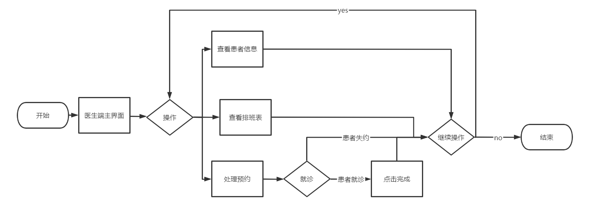
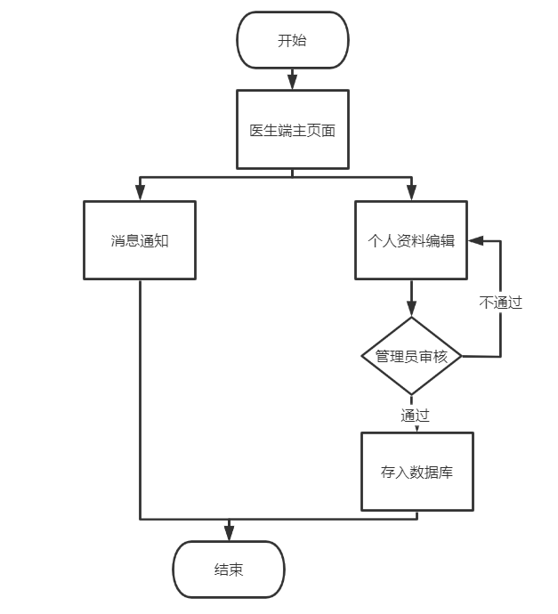
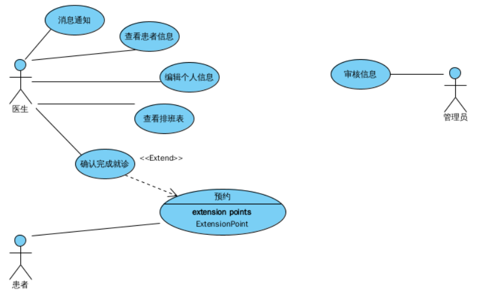

# 需求规格说明书

## 1、引言
&ensp;&ensp;&ensp;&ensp;随着信息技术的发展和普及，越来越多的医疗机构开始采用信息化技术来提高医疗服务的效率和质量，医院预约就诊系统的出现正是基于这一趋势。而本医院预约网站也由此而生。
&ensp;&ensp;&ensp;&ensp;医院预约系统的项目目的和目标是为了提高医院的整体服务质量和效率，方便患者进行就医预约，并提高医院的管理效率和信息化水平。
具体来说，医院预约系统的项目目的和目标包括：

1.提供方便快捷的在线预约服务：通过医院预约系统，患者可以方便地在互联网上进行预约，避免了排队等候和电话预约的繁琐流程，提高了就医的便利性。

2.提高医院的管理效率：医院预约系统可以帮助医院实现数字化、智能化管理，提高医院管理效率和精细化服务水平。

3.提高医院的信息化水平：医院预约系统可以帮助医院实现信息化建设和管理，提高医院的信息化水平和竞争力。

4.提高患者满意度：通过提供方便快捷的在线预约服务和优质的医疗服务，医院预约系统可以提高患者的满意度和信任度，增强医院的品牌形象和声誉。

&ensp;&ensp;&ensp;&ensp;总之，医院预约系统的项目目的和目标是为了提高医院的服务质量和效率，优化医疗资源利用，提高医院的信息化水平和竞争力，最终实现医疗服务的数字化、智能化和精细化。

## 2、系统概述
&ensp;&ensp;&ensp;&ensp;HMS（本医院预约网站）的用户主要是有意愿使用本网站预约就诊的网络使用者或者是使用该网站的医院的医护工作者。 

## 2、目标系统描述

### 2.2 业务流程

#### 2.2.4医生端工作流程

医生端工作流程图：

   		   
 **图2-4** 医生端工作流程图

&ensp;&ensp;&ensp;&ensp;已登录用户可以进入医生端主页面。在医生端主页面中，用户可以查看自己的排班表，查看预约的患者信息，并处理预约等。若患者按时就诊，登录用户还需点击确认结束就诊。

#### 2.2.5医生端个人主页流程

**图2-5** 医生端个人主页流程图

&ensp;&ensp;&ensp;&ensp;已登录用户可以进入医生端主页面。在主页面的下拉框中，用户可以进行个人资料的编辑、查看消息通知等。如果用户修改个人主页中的信息，管理员会对信息进行审核判定。
## 3 系统功能需求

### 3.1 功能模块总体设计

### 3.2 用例图形式分析

#### 3.2.1 医生功能模块

**消息通知用例**

| 类型       | 信息                                                         |
| ---------- | ------------------------------------------------------------ |
| 用例编号   | 201                                                          |
| 用例名称   | 编辑个人信息                                                     |
| 参与者     | 医生                                                         |
| 用例描述   | 用户更新自己的个人信息                                         |
| 触发器     | 用户点击                                                    |
| 前置条件   | 已经有用户登录                                               |
| 后置条件   | 用户的信息被更改，并且同步至后台数据                                     |
| 基本事件流 | 1、点击编辑按钮 2、跳转到个人信息界面 3、用户修改信息 4、向管理员发送修改信息  5、管理员审核打回或通过 6、系统更新信息或通知用户更改失败|

**查看排班表用例**

| 类型       | 信息                                                         |
| ---------- | ------------------------------------------------------------ |
| 用例编号   | 202                                                          |
| 用例名称   | 查看排班表                                                     |
| 参与者     | 医生                                                         |
| 用例描述   | 用户查看自己的排班表                                         |
| 触发器     | 用户点击排                                                     |
| 前置条件   | 已经有用户登录                                               |
| 后置条件   | 跳转至排班表页面                                     |
| 基本事件流 | 1、点击排班信息按钮 2、跳转到排班表页面|

**查看患者信息用例**

| 类型       | 信息                                                         |
| ---------- | ------------------------------------------------------------ |
| 用例编号   | 203                                                          |
| 用例名称   | 查看患者信息                                                     |
| 参与者     | 医生                                                         |
| 用例描述   | 用户查看患者的个人信息                                         |
| 触发器     | 用户点击患                                                     |
| 前置条件   | 已经有用户登录                                               |
| 后置条件   | 跳转至患者个人信息页面                                     |
| 基本事件流 | 1、点击患者信息按钮 2、跳转至患者个人信息页面|

**确认完成问诊用例**

| 类型       | 信息                                                         |
| ---------- | ------------------------------------------------------------ |
| 用例编号   | 204                                                          |
| 用例名称   | 确认完成问诊                                                     |
| 参与者     | 医生                                                         |
| 用例描述   | 用户确认完成问诊                                         |
| 触发器     | 用户点击                                                     |
| 前置条件   | 已经有用户登录，用户已就诊                                               |
| 后置条件   | 预约状态改为“已完成”                                     |
| 基本事件流 | 1、点击完成按钮 2、系统更改预约状态|

**审核信息用例**

| 类型       | 信息                                                         |
| ---------- | ------------------------------------------------------------ |
| 用例编号   | 205                                                          |
| 用例名称   | 审核信息                                                     |
| 参与者     | 管理员                                                         |
| 用例描述   | 用户审核医生上传个人信息                                         |
| 触发器     | 用户点击                                                     |
| 前置条件   | 已经有用户登录，有医生上传信息                                               |
| 后置条件   | 对应信息被更新或者被拒绝                                     |
| 基本事件流 | 1. 管理员接收信息更新请求 2. 对上传的信息进行审核，判断是否违规 3. 信息违规则拒绝更改 4. 信息正常且合理则为数据库录入信息|

## 4、系统性能需求

性能需求点如下表所示。

| 编号 | 性能需求来源名称 | 使用者 | 功能描述                         | 响应要求 | 结果                                 |
| ---- | ---------------- | ------ | -------------------------------- | -------- | ------------------------------------ |
| 1    | 加载消息         | 用户   | 用户获取外界发给他的信息         | 0.5s     | 用户收到消息                         |
| 2    | 个人信息编辑     | 用户   | 用户对于信息进行必要的补充和修改 | 0.5s     | 用户的信息得到更新并且数据库得到更新 |
| 3    | 用户登录注册     | 用户   | 用户实现登陆的功能               | 0.5s     | 用户成功登录到系统或者成功注册账号   |
| 4    | 查找患者信息     | 医生  | 点击患者信息后查找对应患者的个人信息页面               | 0.5s     | 跳转到对应患者个人信息页面   |
## 5、系统界面需求

 ### 5.1 界面需求

### 5.2页面设计
#### 5.2.6 医生端主界面

​&ensp;&ensp;&ensp;&ensp;该页面应实现如下功能：提供给已注册的医生用户处理预约以及跳转到其他功能页面。页面中包含今日的预约记录，每条预约记录由预约时间和患者姓名以及“完成问诊”按钮组成。当问诊结束后，用户可点击“完成问诊”按钮结束此次问诊，预约状态更改为已完成。该页面还具有“排班信息”按钮以及包括“个人信息”按钮和“消息通知”按钮的下拉框。三个按钮分别可跳转到排班信息页面、个人信息页面、消息通知页面。

#### 5.2.7 排班信息界面

&ensp;&ensp;&ensp;&ensp;该页面应实现如下功能：查看排班信息。页面中展示了用户本周所有排班时间的排班表。此外还具有具有“今日候诊”按钮以及包括“个人信息”按钮和“消息通知”按钮的下拉框。三个按钮分别可跳转到医生端主页面、个人信息页面、消息通知页面。

#### 5.2.8 个人信息界面

&ensp;&ensp;&ensp;&ensp;​该页面应实现如下功能：用户查看个人信息、修改个人信息。页个人信息（包括账号、用户名）、修改按钮等。用户点击修改按钮后页面将会提供表单给用户修改个人信息，然后将修改的信息发送给管理员。审核通过则修改成功，否则会返回提示信息。

#### 5.2.8 个人信息界面
1.消息通知用例：作为医生，我希望能查看消息通知，以便能方便地得知消息。

2.查看排班表用例：作为一名医生，我希望能够方便地查看我的排班表，以便我能够准确地安排我的工作日程和提供更加优质的医疗服务。

3.查看患者信息用例：作为医生，我希望能查看预约患者的个人信息界面，以便能获取患者的个人信息与病例。

4.确认完成问诊用例：作为医生，我希望能够方便地确认我的问诊已经完成，以便我能够及时整理患者的病历和方便后续的医疗服务。