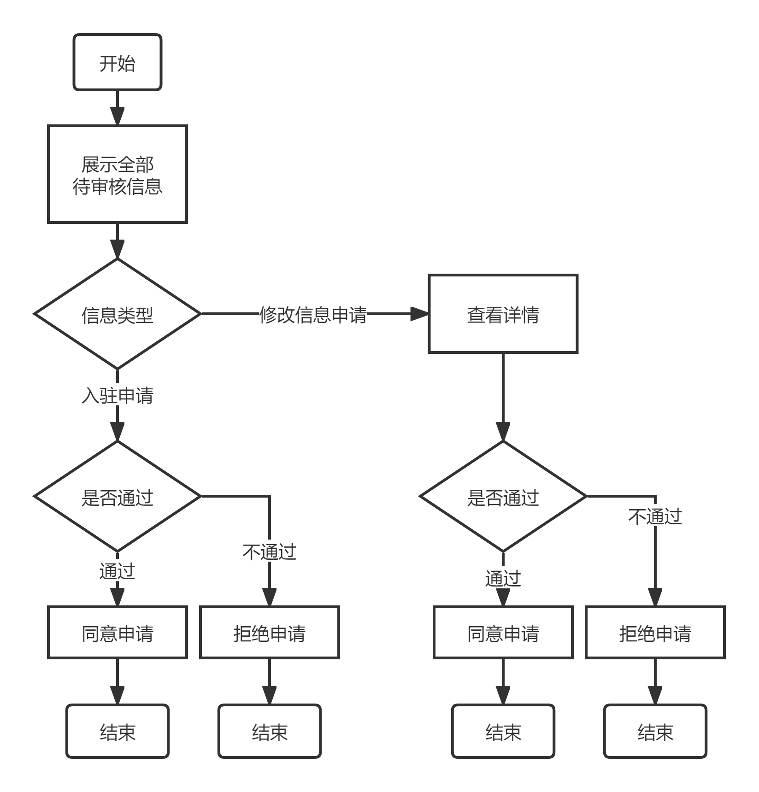

# 需求规格说明书

## 1、引言

## 2、系统概述

## 2、目标系统描述

### 2.2 业务流程

#### 2.2.1后台管理员修改科室信息

后台管理员修改科室信息流程如下：

​											**图2-1** 后台管理员修改科室信息流程图

​		后台管理员在对科室信息进行修改时，需首先输入科室名称，若科室存在，则显示目前科室介绍信息；若科室不存在，系统会给出提示并重新输入。管理员根据现有信息对科室介绍内容进行修改，并点击提交。

#### 2.2.2 后台管理员修改医生信息

后台管理员修改医生信息流程如下：

​														**图2-2** 后台管理员修改医生信息流程图

​		后台管理员在对医生信息进行修改时，需首先输入医生姓名。系统将显示所有符合条件的医生信息。若有目标对象，可点击选择该医生；若不存在，可重新输入医生姓名。选择医生后，会展示医生个人信息。管理员根据现有信息对医生个人信息内容进行修改，并点击提交。

#### 2.2.3信息审核流程

信息审核流程图：

​											**图2-3** 信息审核流程图

​		后台管理员打开信息审核界面后，会显示所有待审核的信息。对于医生的入驻申请，会显示医生的姓名、身份证号和邮箱。管理员可选择同意或拒绝该申请。对于医生或科室的信息修改申请，会显示发起人、所属科室等信息，管理员可点击查看详情，获取消息的详细内容，并也可选择同意或拒绝该申请。

#### 2.2.4医生排班流程

医生排班流程图：

​											**图2-3** 医生排班流程图

​		后台管理员在对医生进行排班时，需根据医生所在的一、二级科室名称筛选医生，并选择想要排班的医生。排班时，既可通过点击时间表手动排班，也可通过导入预制模板的方式一键排班。

## 3 系统功能需求

### 3.1 功能模块总体设计

### 3.2 用例图形式分析

#### 3.2.1 后台管理模块

**修改科室信息用例**

| 类型       | 信息                                                         |
| :--------- | ------------------------------------------------------------ |
| 编号       | 101                                                          |
| 用例名称   | 修改科室信息                                                         |
| 前置条件   | 科室存在                                           |
| 后置条件   | 科室介绍文字被更改                                             |
| 输入       | 科室名称、修改后科室介绍信息 |
| 触发器     | 管理员点击修改按钮                                             |
| 基本事件流 | 1、管理员输入科室信息并查询原有介绍内容  2、系统显示原有介绍内容  3、管理员输入欲修改信息 4、管理员提交信息，科室信息被修改 |
| 用例描述   | 管理员对科室介绍信息进行修改                                                 |

**修改医生信息用例**

| 类型       | 信息                                                         |
| ---------- | ------------------------------------------------------------ |
| 编号       | 102                                                          |
| 用例名称   | 修改医生信息                                                         |
| 前置条件   | 医生存在                                           |
| 后置条件   | 医生个人信息被修改                                         |
| 用例描述   | 后台管理员通过医生姓名对医生进行查找，并修改其个人信息                                 |
| 参与者     | 管理员                                                         |
| 基本事件流 | 1、 管理员输入医生姓名  2、 系统显示所有符合要求的医生供挑选 3、管理员选择想要修改的医生 4、管理员输入修改信息 5、管理员提交修改信息 |
| 触发器     | 点击提交按钮                                                 |

**信息审核用例**

| 类型       | 信息                                                 |
| ---------- | ---------------------------------------------------- |
| 用例编号   | 103                                                  |
| 用例名称   | 信息审核                                        |
| 参与者     | 管理员                                                |
| 用例描述   | 管理员对待审核信息进行查看、审核                                     |
| 前置条件   | 存在未审核信息                                     |
| 后置条件   | 未审核信息得到处理                                   |
| 基本事件流 | 1、 管理员对待审核信息详情进行查看 2、 管理员根据信息内容选择同意或拒绝申请 |

**医生排班用例**

| 类型       | 信息                                                         |
| ---------- | ------------------------------------------------------------ |
| 用例编号   | 104                                                          |
| 用例名称   | 医生排班                                                |
| 用例描述   | 管理员对医生上班时间进行安排                 |
| 前置条件   | 医生存在                                                 |
| 后置条件   | 生成医生排班信息                       |
| 基本事件流 | 1、管理员根据一、二级科室筛选医生 2、管理员选择待排班医生 3、管理员根据时间表或预制模板对医生进行排班 |
| 参与者     | 管理员                                                         |

## 4、系统性能需求

性能需求点如下表所示。

| 编号 | 性能需求来源名称 | 使用者 | 功能描述                         | 响应要求 | 结果                                 |
| ---- | ---------------- | ------ | -------------------------------- | -------- | ------------------------------------ |
| 1    | 检索科室或医生信息  | 管理员   | 在修改信息前，管理员需获取原有信息  | 0.5s     | 管理员收到旧的科室或医生信息                         |

## 5、系统界面需求

 ### 5.1 界面需求

### 5.2页面设计

#### 5.2.1 修改科室信息界面

​		该界面应实现如下功能：根据管理员输入的科室名称查找科室原有介绍信息，并提供输入框，以便管理员键入新版科室介绍内容，并可提交修改。

#### 5.2.2 修改医生信息界面

​		该界面应实现如下功能：根据管理员输入的医生姓名检索符合条件的全部医生，点击某医生后可显示该医生的个人信息。具有修改、提交按钮，以便管理员对可修改字段进行修改和信息的提交。

#### 5.2.3 消息审核界面

​		该界面应实现如下功能：按时间先后顺序显示全部未审核信息，每条信息可显示详情，并具有同意、拒绝按钮，以便管理员对信息进行审核。

#### 5.2.4 医生排班界面

​		该界面应实现如下功能：按两级科室筛选医生，在选择某医生后，会显示该医生每周的上班时间表。管理员可通过点击表格或者通过侧面预制模板一键导入的方式对医生进行排班。

## 扩展需求
### 1.患者可在个人信息页面查看本人电子病历，医生可在患者就诊后对其电子病历进行编辑。
### 2.加入模拟支付系统。
### 3.在患者预约就诊时间前对其进行提醒。
### 4.加入失约信息。