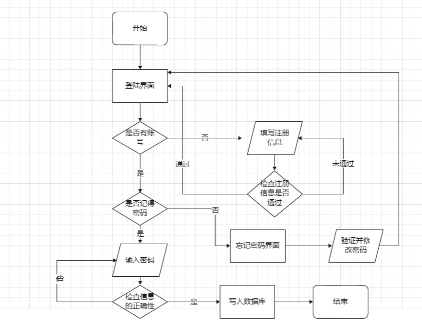
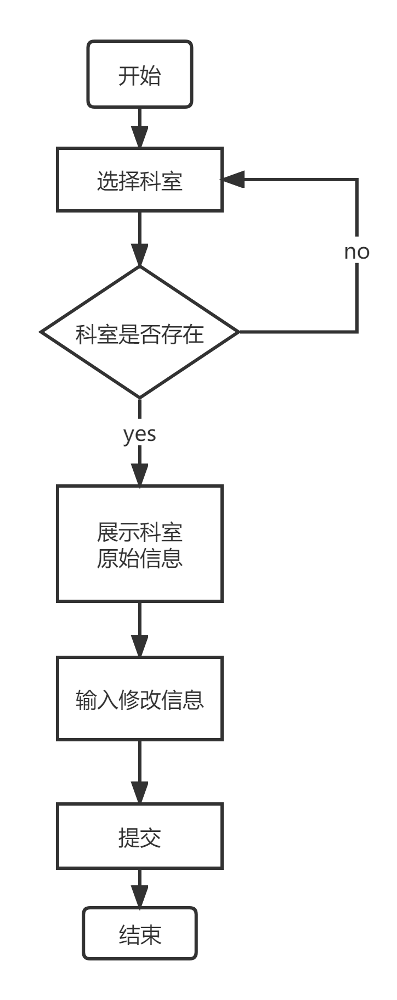
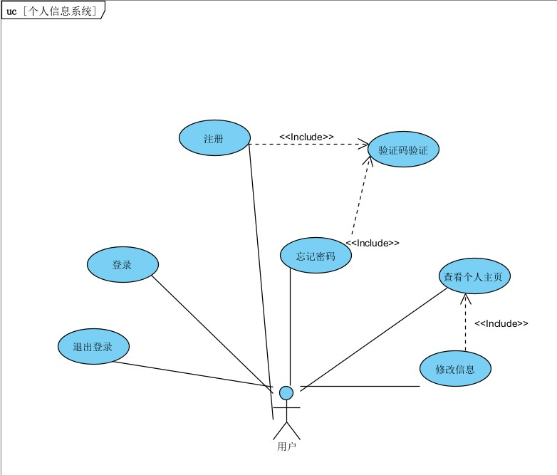
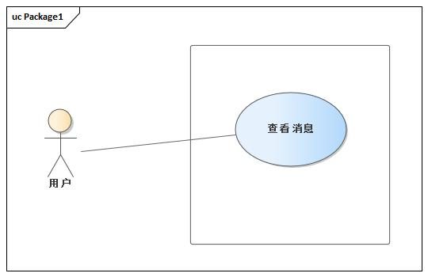

# 需求规格说明书

## 1、引言
&ensp;&ensp;&ensp;&ensp;随着信息技术的发展和普及，越来越多的医疗机构开始采用信息化技术来提高医疗服务的效率和质量，医院预约就诊系统的出现正是基于这一趋势。而本医院预约网站也由此而生。
&ensp;&ensp;&ensp;&ensp;医院预约系统的项目目的和目标是为了提高医院的整体服务质量和效率，方便患者进行就医预约，并提高医院的管理效率和信息化水平。
具体来说，医院预约系统的项目目的和目标包括：

1.提供方便快捷的在线预约服务：通过医院预约系统，患者可以方便地在互联网上进行预约，避免了排队等候和电话预约的繁琐流程，提高了就医的便利性。

2.提高医院的管理效率：医院预约系统可以帮助医院实现数字化、智能化管理，提高医院管理效率和精细化服务水平。

3.提高医院的信息化水平：医院预约系统可以帮助医院实现信息化建设和管理，提高医院的信息化水平和竞争力。

4.提高患者满意度：通过提供方便快捷的在线预约服务和优质的医疗服务，医院预约系统可以提高患者的满意度和信任度，增强医院的品牌形象和声誉。

&ensp;&ensp;&ensp;&ensp;总之，医院预约系统的项目目的和目标是为了提高医院的服务质量和效率，优化医疗资源利用，提高医院的信息化水平和竞争力，最终实现医疗服务的数字化、智能化和精细化。

## 2、系统概述
&ensp;&ensp;&ensp;&ensp;HMS（本医院预约网站）的用户主要是有意愿使用本网站预约就诊的网络使用者或者是使用该网站的医院的医护工作者。 

## 2、目标系统描述

### 2.2 业务流程

#### 2.2.1网站登录注册流程

网站登录注册流程(其中的注册流程包括医生端和患者端）如下：

​											**图2-1 **网站登录注册流程图

​		在用户进行注册的时候，分为患者端的注册和医生端的注册，在进行注册的时候首先需要选择用户的角色，分为患者和医生两个角色。通过所选的角色下面的要求填写的信息表单会有所不同。如果选择医生角色进行注册要求填写所在的科室。但是如果选择患者的话则无需填写。此外两种角色都需要填写姓名、邮箱、身份证号、密码等信息。

#### 2.2.2 个人主页流程

个人主页流程如下：

​														**图2-2** 个人主页流程图

​		如果当前的用户已经登陆进系统，通过点击下拉框中的**个人主页**选项可以进入个人主页的界面，在这里用户可以查阅并补充修改自己的个人信息。在修改完成之后，后台会进行审核，并且将信息通过至数据库以确保信息的正确性。

#### 2.2.3消息通知流程

消息通知流程图：

​											**图2-3** 消息通知流程图

​		用户在已经登录成功的情况下可以点击消息通知选项之跳转到消息通知的界面，在这个界面中我们可以看到未读的消息，同时可以通过点击消息进入具体消息查询的页面进行详情的阅读。

#### 2.2.4医生端工作流程

医生端工作流程图：

   		    **图2-4** 医生端工作流程图

&ensp;&ensp;&ensp;&ensp;已登录用户可以进入医生端主页面。在医生端主页面中，用户可以查看自己的排班表，查看预约的患者信息，并处理预约等。若患者按时就诊，登录用户还需点击确认结束就诊。

#### 2.2.5医生端个人主页流程

**图2-5** 医生端个人主页流程图

&ensp;&ensp;&ensp;&ensp;已登录用户可以进入医生端主页面。在主页面的下拉框中，用户可以进行个人资料的编辑、查看消息通知等。如果用户修改个人主页中的信息，管理员会对信息进行审核判定。

#### 2.2.6 预约挂号流程

预约挂号流程如下：

 

**图**2-6 预约挂号流程图

在患者端已登录的情况下，用户可以点击“预约挂号”按钮进入预约界面。患者首先选择想要预约的日期，然后通过两级科室找到对应的医生，查看其详细信息（职称、介绍、可预约时间等）。如果该医生仍有可预约时间段，患者可以选择预约该医生，在确认信息并支付后成功预约，回到患者端主界面。

 

#### 2.2.7 查看医生信息流程

查看医生信息流程如下：

 

**图** **2-7** 查看医生信息流程图

 

在患者端已登录的情况下，患者可以点击查看医生/科室信息按钮进入查看信息界面。患者根据两级科室找到所要寻找的科室，可以查看科室的信息。也可以查看所选科室中所有医生的信息。

#### 2.2.8 查看个人预约

 

**图** **2-8** 查看个人预约流程

在患者端已登录的情况下，患者可以点击我的预约按钮进入个人预约信息界面。在这里，患者可以查看自己之前所有的预约信息，包括时间、医生、预约状态等。如果预约状态为待就诊，患者可以选择取消该预约，点击确认后，这条预约会从预约信息中删除。

#### 2.2.9后台管理员修改科室信息

后台管理员修改科室信息流程如下：

​											**图2-9** 后台管理员修改科室信息流程图

​		后台管理员在对科室信息进行修改时，需首先输入科室名称，若科室存在，则显示目前科室介绍信息；若科室不存在，系统会给出提示并重新输入。管理员根据现有信息对科室介绍内容进行修改，并点击提交。

#### 2.2.10 后台管理员修改医生信息

后台管理员修改医生信息流程如下：

​														**图2-10** 后台管理员修改医生信息流程图

​		后台管理员在对医生信息进行修改时，需首先输入医生姓名。系统将显示所有符合条件的医生信息。若有目标对象，可点击选择该医生；若不存在，可重新输入医生姓名。选择医生后，会展示医生个人信息。管理员根据现有信息对医生个人信息内容进行修改，并点击提交。

#### 2.2.11信息审核流程

信息审核流程图：

​											**图2-11** 信息审核流程图

​		后台管理员打开信息审核界面后，会显示所有待审核的信息。对于医生的入驻申请，会显示医生的姓名、身份证号和邮箱。管理员可选择同意或拒绝该申请。对于医生或科室的信息修改申请，会显示发起人、所属科室等信息，管理员可点击查看详情，获取消息的详细内容，并也可选择同意或拒绝该申请。

#### 2.2.12医生排班流程

医生排班流程图：

​											**图2-12** 医生排班流程图

​		后台管理员在对医生进行排班时，需根据医生所在的一、二级科室名称筛选医生，并选择想要排班的医生。排班时，既可通过点击时间表手动排班，也可通过导入预制模板的方式一键排班。

## 3 系统功能需求

### 3.1 功能模块总体设计

### 3.2 用例图形式分析

#### 3.2.1 注册登录个人信息模块

**图** **3-1** 注册登录个人信息模块图

**注册用例**

| 类型       | 信息                                                         |
| :--------- | ------------------------------------------------------------ |
| 编号       | 101                                                          |
| 用例名称   | 注册                                                         |
| 前置条件   | 用户未登录且未注册                                           |
| 后置条件   | 用户注册一个账号                                             |
| 输入       | 邮箱号、姓名、身份证号、密码、所在科室（仅医生角色需要填写） |
| 触发器     | 用户点击注册按钮                                             |
| 基本事件流 | 1、用户进入注册页面，输入账号，密码，基本信息  2、系统检测数据合法性，并向邮箱发送验证码  3、用户输入验证码 4、 系统检验结果。返回成功信息，回到登录界面。 |
| 用例描述   | 用户注册账号                                                 |

**登录用例**

| 类型       | 信息                                                         |
| ---------- | ------------------------------------------------------------ |
| 编号       | 102                                                          |
| 用例名称   | 登录                                                         |
| 前置条件   | 用户已经注册过账号                                           |
| 后置条件   | 用户登录该用户的账号                                         |
| 用例描述   | 用户通过填入id和密码进入系统                                 |
| 参与者     | 用户                                                         |
| 基本事件流 | 1、 用户在登录界面，输入账号，密码  2、 系统检验正确性 3、 系统变为登录状态，并切换到主页面 |
| 触发器     | 点击登录按钮                                                 |

**查看个人信息用例**

| 类型       | 信息                                                 |
| ---------- | ---------------------------------------------------- |
| 用例编号   | 103                                                  |
| 用例名称   | 查看个人信息                                         |
| 参与者     | 用户                                                 |
| 用例描述   | 用户查看个人信息                                     |
| 触发器     | 用户点击菜单下拉框中的“个人信息”按钮                 |
| 前置条件   | 用户已经实现登录                                     |
| 后置条件   | 进入个人信息的界面                                   |
| 基本事件流 | 1、 用户点击个人信息按钮 2、 用户进入个人信息页面 |

**修改个人信息用例**

| 类型       | 信息                                                         |
| ---------- | ------------------------------------------------------------ |
| 用例编号   | 104                                                          |
| 用例名称   | 修改个人信息                                                 |
| 用例描述   | 通过点击界面中的编辑按钮，进行个人信息的修改                 |
| 触发器     | 点击个人信息的编辑按钮                                       |
| 前置条件   | 用户已经登陆                                                 |
| 后置条件   | 用户的信息被更改，并且同步至后台数据库                       |
| 基本事件流 | 1、点击编辑按钮 2、跳转到个人信息界面 3、用户修改信息 4、后台接收更新后的数据，并且进行更改 |
| 参与者     | 用户                                                         |

**退出登录用例**

| 类型       | 信息                                                         |
| ---------- | ------------------------------------------------------------ |
| 用例编号   | 105                                                          |
| 用例名称   | 退出登录                                                     |
| 用例描述   | 通过点击退出登录按钮，退出当前登录的用户，并返回登录界面     |
| 触发器     | 点击菜单下拉框中的退出登录的按钮                             |
| 前置条件   | 当前已经有用户登录                                           |
| 后置条件   | 退出当前的登录，回退到登录界面                               |
| 基本事件流 | 1、点击退出登录 2、当前的用户登陆条件被退出 3、回退到登录的界面 |
| 参与者     | 用户                                                         |

**忘记密码用例**

| 类型       | 信息                                                         |
| ---------- | ------------------------------------------------------------ |
| 用例编号   | 106                                                          |
| 用例名称   | 忘记密码                                                     |
| 参与者     | 用户                                                         |
| 用例描述   | 点击后跳转到忘记密码的页面，通过输入邮箱，并且进行验证，可以进行密码的修改 |
| 触发器     | 用户点击忘记密码按钮                                         |
| 前置条件   | 当前没有用户登录                                             |
| 后置条件   | 密码被修改                                                   |
| 基本事件流 | 1、用户点击忘记密码按钮 2、系统跳转时忘记密码的界面 3、用户输入邮箱号，请求发送验证码 4、系统向邮箱发送验证码 5、用户输入验证码，进行验证 6、系统验证输入的验证码的正确性 7、用户进行密码的修改 8、系统将新的密码同步至数据库，并跳转至登录界面 |

**验证码验证用例**

| 类型       | 信息                                                         |
| ---------- | ------------------------------------------------------------ |
| 用例编号   | 107                                                          |
| 用例名称   | 验证码验证                                                   |
| 参与者     | 用户                                                         |
| 用例描述   | 系统将验证码发送到指定的邮箱，用户获取之后填入进行验证       |
| 触发器     | 点击验证身份的按键                                           |
| 前置条件   | 用户填写了邮箱的信息                                         |
| 后置条件   | 用户的身份得到了验证                                         |
| 基本事件流 | 1.用户点击“发送验证码”  2.系统向用户邮箱发送验证码  3.用户输入验证码  4、系统对验证码进行验证 |

#### 3.2.2 消息通知模块

**图** **3-2** 消息通知模块图

**消息通知用例**

| 类型       | 信息                                                         |
| ---------- | ------------------------------------------------------------ |
| 用例编号   | 201                                                          |
| 用例名称   | 消息通知                                                     |
| 参与者     | 用户                                                         |
| 用例描述   | 用户查看接收到的消息                                         |
| 触发器     | 用户点击                                                     |
| 前置条件   | 已经有用户登录                                               |
| 后置条件   | 用户查看了属于自己的消息                                     |
| 基本事件流 | 1、用户点击消息通知按钮 2、系统跳转到消息通知的页面 3、用户选择自己想要阅读的信息 4、系统跳转到展示具体的消息的界面 5、用户阅读进行阅读 |

#### 3.2.3 医生功能模块

**图** **3-3** 医生功能模块图

**消息通知用例**

| 类型       | 信息                                                         |
| ---------- | ------------------------------------------------------------ |
| 用例编号   | 201                                                          |
| 用例名称   | 编辑个人信息                                                     |
| 参与者     | 医生                                                         |
| 用例描述   | 用户更新自己的个人信息                                         |
| 触发器     | 用户点击                                                    |
| 前置条件   | 已经有用户登录                                               |
| 后置条件   | 用户的信息被更改，并且同步至后台数据                                     |
| 基本事件流 | 1、点击编辑按钮 2、跳转到个人信息界面 3、用户修改信息 4、向管理员发送修改信息  5、管理员审核打回或通过 6、系统更新信息或通知用户更改失败|

**查看排班表用例**

| 类型       | 信息                                                         |
| ---------- | ------------------------------------------------------------ |
| 用例编号   | 202                                                          |
| 用例名称   | 查看排班表                                                     |
| 参与者     | 医生                                                         |
| 用例描述   | 用户查看自己的排班表                                         |
| 触发器     | 用户点击排                                                     |
| 前置条件   | 已经有用户登录                                               |
| 后置条件   | 跳转至排班表页面                                     |
| 基本事件流 | 1、点击排班信息按钮 2、跳转到排班表页面|

**查看患者信息用例**

| 类型       | 信息                                                         |
| ---------- | ------------------------------------------------------------ |
| 用例编号   | 203                                                          |
| 用例名称   | 查看患者信息                                                     |
| 参与者     | 医生                                                         |
| 用例描述   | 用户查看患者的个人信息                                         |
| 触发器     | 用户点击患                                                     |
| 前置条件   | 已经有用户登录                                               |
| 后置条件   | 跳转至患者个人信息页面                                     |
| 基本事件流 | 1、点击患者信息按钮 2、跳转至患者个人信息页面|

**确认完成问诊用例**

| 类型       | 信息                                                         |
| ---------- | ------------------------------------------------------------ |
| 用例编号   | 204                                                          |
| 用例名称   | 确认完成问诊                                                     |
| 参与者     | 医生                                                         |
| 用例描述   | 用户确认完成问诊                                         |
| 触发器     | 用户点击                                                     |
| 前置条件   | 已经有用户登录，用户已就诊                                               |
| 后置条件   | 预约状态改为“已完成”                                     |
| 基本事件流 | 1、点击完成按钮 2、系统更改预约状态|

**审核信息用例**

| 类型       | 信息                                                         |
| ---------- | ------------------------------------------------------------ |
| 用例编号   | 205                                                          |
| 用例名称   | 审核信息                                                     |
| 参与者     | 管理员                                                         |
| 用例描述   | 用户审核医生上传个人信息                                         |
| 触发器     | 用户点击                                                     |
| 前置条件   | 已经有用户登录，有医生上传信息                                               |
| 后置条件   | 对应信息被更新或者被拒绝                                     |
| 基本事件流 | 1. 管理员接收信息更新请求 2. 对上传的信息进行审核，判断是否违规 3. 信息违规则拒绝更改 4. 信息正常且合理则为数据库录入信息|

#### 3.2.4查看医生信息模块

**图** **3-4**查看医生信息模块图

**“查找医生”用例**

**表1-1** “查找医生”用例介绍表

|   编号   |                             101                              |
| :------: | :----------------------------------------------------------: |
|   名称   |                           查找医生                           |
| 使用人员 |                          已注册患者                          |
|  扩展点  |                              无                              |
|   输入   |                           科室名称                           |
| 系统响应 |                    显示符合条件的医生列表                    |
|   输出   |                           医生列表                           |
| 前置条件 |                        患者已注册登录                        |
| 后置条件 |                              无                              |
| 活动步骤 | 1. 患者在主界面点击“查看医生信息“，进入查询界面  2. 患者选择两级科室  3. 系统查询科室中的医生信息  4. 系统显示符合条件的医生列表 |
| 异常处理 |            如果查询不到医生，系统显示无医生信息。            |
| 详细说明 |             已注册登录用户通过科室找到医生信息。             |

 

**“查看医生信息”用例**

**表1-2** “查看医生信息”用例介绍表

|   编号   |                             102                              |
| :------: | :----------------------------------------------------------: |
|   名称   |                         查看医生信息                         |
| 使用人员 |                          已注册患者                          |
|  扩展点  |                              无                              |
|   输入   |                              无                              |
| 系统响应 |                         显示医生信息                         |
|   输出   |                           医生信息                           |
| 前置条件 |                患者已注册登录，已经查找到医生                |
| 后置条件 |                              无                              |
| 活动步骤 | 1.患者从医生列表中选择一个医生； 2. 系统显示医生的详细信息。 |
| 异常处理 |       如果查询不到医生的详细信息，系统显示无医生信息。       |
| 详细说明 | 已注册登录用户查找到医生后可以查看医生详细信息，如名字、职称、介绍等。 |

 

 

#### 3.2.5预约挂号模块

 

**图** **3-5** 预约挂号模块图

**“查找空闲医生”用例**

**表2-1** “查找空闲医生”用例介绍表

| 编号     | 201                                                          |
| -------- | ------------------------------------------------------------ |
| 名称     | 查找空闲医生                                                 |
| 使用人员 | 已注册患者                                                   |
| 扩展点   | 无                                                           |
| 输入     | 科室名称、日期                                               |
| 系统响应 | 显示符合条件的医生列表                                       |
| 输出     | 医生列表                                                     |
| 前置条件 | 患者已注册登录                                               |
| 后置条件 | 无                                                           |
| 活动步骤 | 1. 患者在主界面点击“查看医生信息“，进入查询界面  2. 患者选择两级科室和日期  3. 系统查询科室中的医生信息  4. 系统显示符合条件的医生列表 |
| 异常处理 | 如果查询不到医生，系统显示无医生信息。                       |
| 详细说明 | 已注册登录用户通过科室和日期找到该科室当日有空闲时段的医生信息。 |

 

**“查看医生空闲时间段”用例**

**表2-2** “查看医生空闲时间段”用例介绍表

|   编号   |                             202                              |
| :------: | :----------------------------------------------------------: |
|   名称   |                      查看医生空闲时间段                      |
| 使用人员 |                          已注册患者                          |
|  扩展点  |                              无                              |
|   输入   |                              无                              |
| 系统响应 |                   显示医生信息和空闲时间段                   |
|   输出   |                     医生信息和空闲时间段                     |
| 前置条件 |              患者已注册登录，已经查找到空闲医生              |
| 后置条件 |                              无                              |
| 活动步骤 | 1.患者从空闲医生列表中选择一个医生； 2. 系统显示医生的信息和空闲时间段 |
| 异常处理 |          如果查询不到医生信息，系统显示无医生信息。          |
| 详细说明 |  已注册登录用户查找到医生后可以查看医生信息以及可预约时间段  |

 

**“预约挂号”用例**

**表2-3** “预约挂号”用例介绍表

| 编号     | 203                                                          |
| -------- | ------------------------------------------------------------ |
| 名称     | 预约挂号                                                     |
| 使用人员 | 已注册患者                                                   |
| 扩展点   | 无                                                           |
| 输入     | 日期、医生、患者信息                                         |
| 系统响应 | 预约成功或失败信息                                           |
| 输出     | 预约成功或失败信息                                           |
| 前置条件 | 患者已注册登录 ，已查找到医生及其可预约时间段                |
| 后置条件 | 无                                                           |
| 活动步骤 | 1. 患者点击医生的可预约时间段； 2. 患者确认预约信息； 3. 患者进行支付； 4. 系统处理预约请求，返回预约成功或失败信息。 |
| 异常处理 | 1.如果如果选择的预约时间段已被其他患者预约，系统提示选择其他时间段； 2. 如果支付失败，系统提示支付失败信息。 |
| 详细说明 | 用户可以通过医生和可预约时间段来预约挂号，预约成功后系统返回预约成功的信息，包括预约编号、预约时间、医生信息等。预约过程需要患者登录系统，并在确认预约信息后进行支付。异常处理包括输入无效的医生ID、选择已被预约的时间段和支付失败的情况。 |

 

**“支付”用例**

**表2-4** “支付“用例介绍表

| 编号     | 204                                                          |
| -------- | ------------------------------------------------------------ |
| 名称     | 支付                                                         |
| 使用人员 | 已注册患者                                                   |
| 扩展点   | 无                                                           |
| 输入     | 预约费用、支付方式                                           |
| 系统响应 | 支付成功或失败                                               |
| 输出     | 支付成功或失败信息                                           |
| 前置条件 | 患者已选择预约挂号并确认预约信息                             |
| 后置条件 | 无                                                           |
| 活动步骤 | 1. 患者选择支付方式； 2. 患者输入支付信息； 3. 系统向第三方支付平台发送支付请求； 4. 第三方支付平台返回支付结果。 |
| 异常处理 | 如果支付失败，系统提示支付失败信息。                         |
| 详细说明 | 患者在预约挂号后支付预约费用，支付成功后预约方可成功。       |

 

#### 3.2.6我的预约模块

**图** **3-6**我的预约模块图

**“查看预约信息”用例**

**表3-1** “查看预约信息”用例介绍表

| 编号     |                             301                              |
| -------- | :----------------------------------------------------------: |
| 名称     |                         查看预约信息                         |
| 使用人员 |                          已注册患者                          |
| 扩展点   |                              无                              |
| 输入     |                              无                              |
| 系统响应 |                       显示预约信息列表                       |
| 输出     |                         预约信息列表                         |
| 前置条件 |                        患者已注册登录                        |
| 后置条件 |                              无                              |
| 活动步骤 | 1. 患者请求查看预约信息； 2. 系统检索并返回患者所有的历史预约信息。 |
| 异常处理 | 1.如果患者没有历史预约信息，系统提示无历史预约信息； 2. 如果系统检索失败，系统提示检索失败信息。 |
| 详细说明 | 患者可以通过查看预约信息功能查看自己所有的历史预约信息，包括预约时间、医生、科室、预约状态等。系统会根据患者的预约记录进行检索，并返回相应的预约信息列表。 |

 

**“取消预约”用例**

**表3-2** “取消预约”用例介绍表

|   编号   |                             302                              |
| :------: | :----------------------------------------------------------: |
|   名称   |                           取消预约                           |
| 使用人员 |                          已注册患者                          |
|  扩展点  |                              无                              |
|   输入   |                          预约信息ID                          |
| 系统响应 |                       取消成功或者失败                       |
|   输出   |                       取消成功或者失败                       |
| 前置条件 |            患者已成功预约过挂号，并且预约尚未就诊            |
| 后置条件 |                  预约信息删除成功/删除失败                   |
| 活动步骤 | 1.患者请求取消待就诊的预约； 2. 系统检查预约信息的状态，如果是待就诊状态，则执行取消操作并返回取消成功，否则返回取消失败。 |
| 异常处理 |           如果取消操作失败，系统返回取消失败信息。           |
| 详细说明 | 患者可以通过取消预约功能取消自己待就诊的预约，预约信息会被从系统中删除。 |

#### 3.2.7 后台管理模块

**修改科室信息用例**

| 类型       | 信息                                                         |
| :--------- | ------------------------------------------------------------ |
| 编号       | 101                                                          |
| 用例名称   | 修改科室信息                                                 |
| 前置条件   | 科室存在                                                     |
| 后置条件   | 科室介绍文字被更改                                           |
| 输入       | 科室名称、修改后科室介绍信息                                 |
| 触发器     | 管理员点击修改按钮                                           |
| 基本事件流 | 1、管理员输入科室信息并查询原有介绍内容  2、系统显示原有介绍内容  3、管理员输入欲修改信息 4、管理员提交信息，科室信息被修改 |
| 用例描述   | 管理员对科室介绍信息进行修改                                 |

**修改医生信息用例**

| 类型       | 信息                                                         |
| ---------- | ------------------------------------------------------------ |
| 编号       | 102                                                          |
| 用例名称   | 修改医生信息                                                 |
| 前置条件   | 医生存在                                                     |
| 后置条件   | 医生个人信息被修改                                           |
| 用例描述   | 后台管理员通过医生姓名对医生进行查找，并修改其个人信息       |
| 参与者     | 管理员                                                       |
| 基本事件流 | 1、 管理员输入医生姓名  2、 系统显示所有符合要求的医生供挑选 3、管理员选择想要修改的医生 4、管理员输入修改信息 5、管理员提交修改信息 |
| 触发器     | 点击提交按钮                                                 |

**信息审核用例**

| 类型       | 信息                                                         |
| ---------- | ------------------------------------------------------------ |
| 用例编号   | 103                                                          |
| 用例名称   | 信息审核                                                     |
| 参与者     | 管理员                                                       |
| 用例描述   | 管理员对待审核信息进行查看、审核                             |
| 前置条件   | 存在未审核信息                                               |
| 后置条件   | 未审核信息得到处理                                           |
| 基本事件流 | 1、 管理员对待审核信息详情进行查看 2、 管理员根据信息内容选择同意或拒绝申请 |

**医生排班用例**

| 类型       | 信息                                                         |
| ---------- | ------------------------------------------------------------ |
| 用例编号   | 104                                                          |
| 用例名称   | 医生排班                                                     |
| 用例描述   | 管理员对医生上班时间进行安排                                 |
| 前置条件   | 医生存在                                                     |
| 后置条件   | 生成医生排班信息                                             |
| 基本事件流 | 1、管理员根据一、二级科室筛选医生 2、管理员选择待排班医生 3、管理员根据时间表或预制模板对医生进行排班 |
| 参与者     | 管理员                                                       |

## 4、系统性能需求

性能需求点如下表所示。

| 编号 | 性能需求来源名称 | 使用者 | 功能描述                         | 响应要求 | 结果                                 |
| ---- | ---------------- | ------ | -------------------------------- | -------- | ------------------------------------ |
| 1    | 加载消息         | 用户   | 用户获取外界发给他的信息         | 0.5s     | 用户收到消息                         |
| 2    | 个人信息编辑     | 用户   | 用户对于信息进行必要的补充和修改 | 0.5s     | 用户的信息得到更新并且数据库得到更新 |
| 3    | 用户登录注册     | 用户   | 用户实现登陆的功能               | 0.5s     | 用户成功登录到系统或者成功注册账号   |
| 4    | 查找患者信息     | 医生  | 点击患者信息后查找对应患者的个人信息页面               | 0.5s     | 跳转到对应患者个人信息页面   |
| 5   | 检索科室或医生信息  | 管理员   | 在修改信息前，管理员需获取原有信息  | 0.5s     | 管理员收到旧的科室或医生信息                         |
## 5、系统界面需求

 ### 5.1 界面需求

### 5.2页面设计

#### 5.2.1 用户信息界面

​		用户界面的左上角用于防止用户的头像，这个头像由用户自己进行上传。这个头像的下面是一个"编辑"按钮，点击这个按钮之后可以进行信息的修改。在右边的部分是用户的个人信息的展示，最上面的是用户的姓名和id号两个最重要的信息。在下面是一些其他的用户信息包括用户登记的邮箱、用户的身份证号、年龄和所属的地区。

​		这里还需要强调的是由于用户的角色分为**患者**和**医生**两个角色，所以说在个人信息的展示会有所不同：

​		**·医生**：会展示这个医生所属的诊室以及这个医生的履历的简介。

​		**·患者**：会展示这个患者的病历。

​		这些信息供用户查阅和修改，在信息表的下面有一个保存按钮，当用户修改之后点击将会对于更改的信息进行修改。

#### 5.2.2 消息通知界面

​		该界面会将该用户收到的信息以条状的信息在界面中一一的陈列起来，按照收到消息的时间进行排序，同时含有已读和未读标志。当用户想要进行全文的阅读的时候，可以点击之后进行详细的阅读。

#### 5.2.3 用户登录界面

​		用户登录界面，一般的来说是用户的第一个界面，该界面的主要内容是界面中间的一个表框。正常的登录主要的内容是中间的两个表框分别填写用户id和密码，然后是一个单选框，这个单选框用于确认身份，分别是"患者身份进入"和"非患者身份进入"：

​				**·患者**：选择"患者身份进入"；

​				**·医生和后台管理员**:选择"非患者身份进入"；

​		在单选框下面是两个链接分别是"点击注册"和"忘记密码"。点击"点击注册"之后可以跳转至登录的界面，点击"忘记密码"可以跳转至忘记密码的页面。

​		最后是一个"进入"按钮，点击即可登录。

#### 5.2.4 用户注册界面

​		该界面的主要内容是中间的一个填写表框，首先是确认用户身份的一个单选框，使得用户在"我是医生"和"我是患者"之间进行一个选择。如果用户选择"我是患者"表框不会发生明显的变化,但是如果用户选择"我是医生"则会在下面弹出所在科室的表单让医生进行填写。

​		后面的填写信息依次是"邮箱"，"姓名"，"身份证号"，"密码"，"输入密码再次确认"。用户填写对应在后面的表单。

​		最后面的是验证码，用户点击验证码后面的"获取验证码"按钮，将会有验证码发送至邮箱。最下面是点击注册按钮。

​		对于这两种不同的角色，对应的数据也会传输到不同的数据库中。

#### 5.2.5 忘记密码界面

​		该界面主要的内容集中在中间的表框上，里面有一个和用户注册界面相同的获得验证码的项，下面分别是密码和确认密码的两项用于用户进行密码的修改。最下方是"确认修改"按钮，点击实现密码的找回。

#### 5.2.6 医生端主界面

&ensp;&ensp;&ensp;&ensp;该页面应实现如下功能：提供给已注册的医生用户处理预约以及跳转到其他功能页面。页面中包含今日的预约记录，每条预约记录由预约时间和患者姓名以及“完成问诊”按钮组成。当问诊结束后，用户可点击“完成问诊”按钮结束此次问诊，预约状态更改为已完成。该页面还具有“排班信息”按钮以及包括“个人信息”按钮和“消息通知”按钮的下拉框。三个按钮分别可跳转到排班信息页面、个人信息页面、消息通知页面。

#### 5.2.7 排班信息界面

&ensp;&ensp;&ensp;&ensp;该页面应实现如下功能：查看排班信息。页面中展示了用户本周所有排班时间的排班表。此外还具有具有“今日候诊”按钮以及包括“个人信息”按钮和“消息通知”按钮的下拉框。三个按钮分别可跳转到医生端主页面、个人信息页面、消息通知页面。

#### 5.2.8 个人信息界面

&ensp;&ensp;&ensp;&ensp;​该页面应实现如下功能：用户查看个人信息、修改个人信息。页个人信息（包括账号、用户名）、修改按钮等。用户点击修改按钮后页面将会提供表单给用户修改个人信息，然后将修改的信息发送给管理员。审核通过则修改成功，否则会返回提示信息。

#### 5.2.9 修改科室信息界面

​		修改科室信息界面的示意图如下：

管理员可在下方的输入框中键入修改信息，并点击右侧的“提交”按钮进行信息修改的提交。

#### 5.2.10 修改科室信息界面

​		修改科室信息界面的示意图如下：

图一
在点击下方的“修改”按钮后，界面将变成下图所示：

图二
此时管理员可对可修改字段进行编辑，提交后将再次变成图一式样。

#### 5.2.11 消息审核界面

​		消息审核界面如图所示。

对于信息修改申请，管理员在点击“查看详情”后，会弹出下图所示的详情页。

在管理员选择了“同意”或“拒绝”后，该消息卡片会消失。

#### 5.2.12 医生排班界面

​		医生排班页面如下图所示。

首先选择科室，随后显示出根据科室筛选的医生列表。

在选择了某个医生后，会弹出窗口以便进行排班。

管理员可点击表格中的时间段进行排班，或者选择右侧的预制模板一键导入。