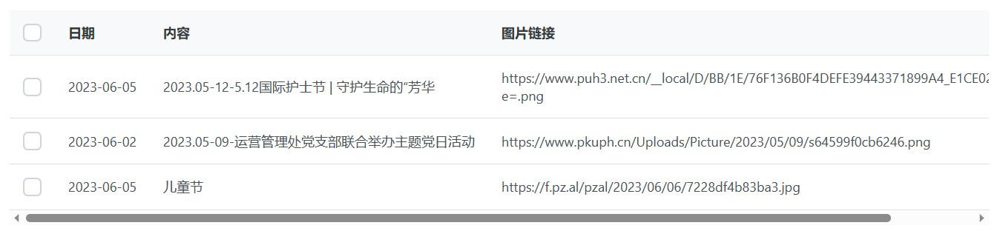

# HMS医院门诊预约系统

**[**软件实现说明书**]**

 

| 成员 | 杨宏飞 |
| ---- | ------ |
| 成员 | 赵子璁 |
| 成员 | 陶佑鹏 |
| 成员 | 孙宇航 |
| 成员 | 张昊然 |

- [HMS医院门诊预约系统](#hms医院门诊预约系统)
- [1.   引言](#1---引言)
  - [1.1 编写目的](#11-编写目的)
  - [1.2 命名规范](#12-命名规范)
  - [1.3 参考资料](#13-参考资料)
  - [1.4 相关文档](#14-相关文档)
- [2.   前后端技术选型介绍](#2---前后端技术选型介绍)
  - [2.1 前端技术选型](#21-前端技术选型)
    - [2.1.1 概述](#211-概述)
    - [2.1.2 Vue3](#212-vue3)
    - [2.1.3 PrimeVue](#213-primevue)
    - [2.1.4 npm](#214-npm)
    - [2.1.5 node.js](#215-nodejs)
    - [2.1.6 vscode](#216-vscode)
  - [2.2 后端技术选型](#22-后端技术选型)
    - [2.2.1 概述](#221-概述)
    - [2.2.2 SpringBoot](#222-springboot)
    - [2.2.3 MyBatis](#223-mybatis)
    - [2.2.4 MySQL](#224-mysql)
    - [2.2.5 JMeter](#225-jmeter)
- [3.   实现思路](#3---实现思路)
- [4.   从设计模型到代码实现](#4---从设计模型到代码实现)
  - [4.1 后端实现](#41-后端实现)
    - [4.1.1 数据持久化层实现](#411-数据持久化层实现)
    - [4.1.2 实体类实现](#412-实体类实现)
    - [4.1.3 Controller层实现](#413-controller层实现)
    - [4.1.4 Service层实现](#414-service层实现)
    - [4.1.5 Dao层实现](#415-dao层实现)
  - [4.2 前端实现](#42-前端实现)
    - [4.2.1 template部分](#421-template部分)
    - [4.2.2 script部分](#422-script部分)
    - [4.2.3 style部分](#423-style部分)

 

# 1.   引言

## 1.1 编写目的

本软件实现说明书为从需求到具体实现的重要指导，包括了前端、后端技术的具体选型及理由，以及根据软件设计说明书进行实现过程中的基本思路、设计模型到前后端代码映射方法的介绍。基于此文档，开发人员将进一步理清开发思路，也便于客户对开发过程有更清晰的了解。

## 1.2 命名规范

● 常量以大写英文字母命名，其他变量用小写英文字母开头。

● 所用函数用小写英文字母开头的驼峰式命名。

●  所有类用大写英文字母开头的驼峰式命名。

## 1.3 参考资料

[1] 吕云翔，软件工程——理论与实践（第2版），北京：人民邮电出版社，2018.

[2] “HMS医院门诊预约系统”需求规格说明书

[3] “HMS医院门诊预约系统”软件设计说明书

## 1.4 相关文档

“HMS医院门诊预约系统”的《需求规格说明书》、《软件设计说明书》

 

# 2.   前后端技术选型介绍

## 2.1 前端技术选型

### 2.1.1 概述
本项目的前端开发技术选型采用Vue3+PrimeVue（组件库）作为核心的开发技术，采用npm+node.js进行前端包的管理，并使用vscode进行开发。下面对上述技术或产品进行详细介绍。

### 2.1.2 Vue3
Vue (发音为 /vjuː/，类似 view) 是一款用于构建用户界面的 JavaScript 框架。它基于标准 HTML、CSS 和 JavaScript 构建，并提供了一套声明式的、组件化的编程模型，帮助我们能够高效地开发用户界面。

Vue具有两个核心功能：声明式渲染和响应性。
- 声明式渲染：Vue 基于标准 HTML 拓展了一套模板语法，使得我们可以声明式地描述最终输出的 HTML 和 JavaScript 状态之间的关系。
- 响应性：Vue 会自动跟踪 JavaScript 状态并在其发生变化时响应式地更新 DOM。

相较于Vue2，Vue3具有如下变化：
- 响应式原理发生了改变。Vue2 的响应式原理是利⽤es5 的⼀个 API ，Object.defineProperty()对数据进⾏劫持结合发布订阅模式的⽅式来实现的。Vue3 中使⽤了 es6 的 proxy API 对数据代理，通过 reactive() 函数给每⼀个对象都包⼀层 Proxy，通过 Proxy 监听属性的变化，从而实现对数据的监控。
- Vue3支持碎片(Fragments)，就是说在组件可以拥有多个根节点。
- 数据和方法的定义。Vue2使⽤的是选项类型API（Options API），Vue3使⽤的是组合式API（Composition API）。
- 生命周期钩子。Vue2中的部分生命周期钩子与setup进行了合并。
- 父子通信。

### 2.1.3 PrimeVue
PrimeVue 是一套由著名组件库供应商公司 PrimeTek Informatics 创建的、非常优秀的 Vue UI 组件库，它支持 Vue 3，组件丰富，定制性很强。

PrimeVue是一个与设计无关的库，与其他UI库不同，它不强制使用某种样式（例如：material 或者 bootstrap）。实现原理是将样式分为 core 和 theme。core 驻留在 PrimeVue 内部，以实现和组件结构相关的效果，例如定位，而 theme 实现颜色，填充和边距。同时 PrimeVue 提供各种免费开源的主题和高级主题，我们可以从各种主题中进行选择，也可以使用官方提供 Theme Designer 工具轻松开发自己的主题。

### 2.1.4 npm
npm 是 Node.js 的包管理工具，用来安装各种 Node.js 的扩展。

npm 是 JavaScript 的包管理工具，也是世界上最大的软件注册表。有超过 60 万个 JavaScript 代码包可供下载，每周下载约 30 亿次。npm 让 JavaScript 开发人员可以轻松地使用其他开发人员共享的代码。

npm 由三个不同的部分组成：
- 网站
- 注册表
- 命令行界面(CLI)

### 2.1.5 node.js
Node.js发布于2009年5月，由Ryan Dahl开发，是一个基于Chrome V8引擎的JavaScript运行环境，使用了一个事件驱动、非阻塞式I/O模型，让JavaScript 运行在服务端的开发平台，它让JavaScript成为与PHP、Python、Perl、Ruby等服务端语言平起平坐的脚本语言。

Node.js对一些特殊用例进行优化，提供替代的API，使得V8在非浏览器环境下运行得更好，V8引擎执行Javascript的速度非常快，性能非常好，基于Chrome JavaScript运行时建立的平台， 用于方便地搭建响应速度快、易于扩展的网络应用。

### 2.1.6 vscode
vscode(全名Visual Studio Code)是一款免费，开源，高性能，跨平台，轻量级的代码编辑器，同时支持诸如调试，任务执行和版本管理之类的开发操作。它的目标是提供一种快速的编码编译调试工具。然后将其余部分留给IDE。vscode集成了所有一款现代编辑器所应该具备的特性，包括语法高亮、可定制的热键绑定、括号匹配、以及代码片段收集等。

## 2.2 后端技术选型

### 2.2.1 概述
本项目后端使用SpringBoot开发框架，使用MyBatis进行数据库访问，数据库选择经典关系型数据库MySQL，开发工具使用IntelliJ IDEA以及Navicat，jdk版本为jdk17，压力测试工具使用JMeter。

### 2.2.2 SpringBoot
Spring Boot是由Pivotal团队提供的全新框架，其设计目的是用来简化新Spring应用的初始搭建以及开发过程。

该框架使用了特定的方式来进行配置，从而使开发人员不再需要定义样板化的配置。其基于Spring4.0设计，不仅继承了Spring框架原有的优秀特性，而且还通过简化配置来进一步简化了Spring应用的整个搭建和开发过程。

另外SpringBoot通过集成大量的框架使得依赖包的版本冲突，以及引用的不稳定性等问题得到了很好的解决。

### 2.2.3 MyBatis
MyBatis 是一款优秀的持久层框架，它支持定制化 SQL、存储过程以及高级映射。

MyBatis 避免了几乎所有的 JDBC 代码和手动设置参数以及获取结果集。MyBatis 可以使用简单的 XML 或注解来配置和映射原生信息，将接口和 Java 的 POJOs(Plain Ordinary Java Object，普通的 Java对象)映射成数据库中的记录。

### 2.2.4 MySQL
MySQL是一个关系型数据库管理系统，由瑞典MySQL AB 公司开发，属于 Oracle 旗下产品。MySQL 是最流行的关系型数据库管理系统之一，在 WEB 应用方面，MySQL是最好的 RDBMS (Relational Database Management System，关系数据库管理系统) 应用软件之一。

MySQL是一种关系型数据库管理系统，关系数据库将数据保存在不同的表中，而不是将所有数据放在一个大仓库内，这样就增加了速度并提高了灵活性。

MySQL所使用的 SQL 语言是用于访问数据库的最常用标准化语言。MySQL 软件采用了双授权政策，分为社区版和商业版，由于其体积小、速度快、总体拥有成本低，尤其是开放源码这一特点，一般中小型和大型网站的开发都选择 MySQL 作为网站数据库。

### 2.2.5 JMeter
JMeter 是 apache 公司基于 Java 开发的一款开源压力测试工具，体积小，功能全，使用方便，是一个比较轻量级的测试工具，使用起来非常简单。

JMeter 可以做接口测试和压力测试。其中接口测试的简单操作包括做 http 脚本（发 get/post 请求、加 cookie、加 header、加权 限认证、上传文件）、做 webservice 脚本、参数化、断言、关联（正则表达式提取器和处理 json-json path extractor）和 JMeter 操作数据库等等。

# 3.   实现思路
在本项目的实现过程中，应遵守如下思路：
- 根据之前的需求分析及设计，新建前端和后端的project并对具体设置进行调整。
- 前端依托npm、后端依托maven进行相关包管理。
- 构建配置文件，对web.xml、pom.xml、application.properties等文件进行配置
- 建立前后端代码的项目结构，如后端需分为Dap层、Controller层、Service层等
- 前后端分别进行开发。由于前端开发人数较多，尤其要注意使用git进行代码管理，尽量避免代码冲突发生；对于后端，应遵守接口规范，以便前端之后进行对接。
- 前后端根据接口文档进行对接，解决字段类型、跨域等问题
- 后端进行单元测试，对各层的代码以及全部功能进行测试
- 前端完善数据校验等细节
- 进行模块整合测试

# 4.   从设计模型到代码实现

## 4.1 后端实现

### 4.1.1 数据持久化层实现
在之前的《软件设计说明书》中，已经列出了本项目所需的所有表结构以及其中各字段和要求。因此在实现阶段，只需按其所写对数据表进行构建，并在建表的SQL语句中对约束予以体现即可。

下面以表admin为例。其设计表结构如下：

表 4-1-1 admin表设计

| 序号 | 英文字段名     | 中文名     | 数据类型       | 是否可为空 | 主键/外键 |
| ---- | -------------- | ---------- | -------------- | ---------- | --------- |
| 1    | admin_id       | 管理员id   | Int            | N          | 主键      |
| 2    | admin_password | 管理员密码 | varchar（255） | N          |           |

SQL建表语句如下：

    CREATE TABLE admin (
    admin_id int NOT NULL,
    admin_password varchar(255) NOT NULL,
    PRIMARY KEY (admin_id)
    )

### 4.1.2 实体类实现
根据数据库设计时的表结构与字段，可写出实体类。

依然以admin为例，实体类结构如下：

    public class Admin {
        private Integer adminId;
        private String adminPassword;
    }

### 4.1.3 Controller层实现
根据《需求规格说明书》以及《软件设计说明书》，对于每个模块中应该具有哪些功能都有了较为详细的规定。每个功能就对应了Controller层的一个接口。

以获取登录医生的个人信息这一功能为例，其Controller层实现如下：

    @GetMapping("/getDoctorInformation")
        public R<Doctor> getDoctorInformation(HttpServletRequest request, @RequestParam String token){
            String nowLoggedInId = (String) TokenUtil.parse(token).get(Const.NOW_LOGGED_IN_ID);
            return R.success(doctorService.getDoctorById(nowLoggedInId));
        }

### 4.1.4 Service层实现
作为“功能”和“实体”之间的桥梁，Service层实现了Controller层与数据之间的交互。在这一层中，主要处理Controller层在处理功能需求时所需要的操作底层数据的逻辑部分。以上面用到的getDoctorById函数为例，其在Service层的实现如下：

    public Doctor getDoctorById(String doctorId){
            try {
                Doctor doctor = doctorDao.getById(doctorId);
                if(doctor.isDoctorStatus())return doctor;
                return null;
            }catch (Exception e){
                return null;
            }
        }

### 4.1.5 Dao层实现
作为唯一能对实体类进行操作的一层，在Dao层中，可以直接对数据库进行增删改查操作。以上文中出现的getById函数为例，其Dao层实现如下：

    @Select("SELECT * FROM doctor WHERE doctor_id = #{doctorId}")
        public Doctor getById(String doctorId);

至此，我们展示了一个完整的后端逻辑功能的实现过程。其余功能依照此进行实现。

## 4.2 前端实现

由于本项目前端使用Vue3框架，因此前端实现将分为template、script、style三部分进行分析。

### 4.2.1 template部分
在template部分中，规定了页面中的组件及其相关属性。根据《软件设计说明书》中的“功能模块设计”部分的原型，可以较为方便地设计出页面。

下面以后台管理页面中新闻展示组件为例，其设计图如下：

图 4-2-1 新闻展示组件示例图

其template部分如下：

    <template>
        

            <DataTable v-model:selection="selectedProduct" :value="products" dataKey="id" tableStyle="min-width: 50rem" scrollable scrollHeight="450px">
                <Column selectionMode="multiple" headerStyle="width: 3rem"></Column>
                <Column field="date" header="日期"></Column>
                <Column field="body" header="内容"></Column>
                <Column field="img" header="图片链接" style="max-width: 600px;"></Column>
            </DataTable>
        

    </template>

### 4.2.2 script部分
script标签中，若不加说明则默认为JavaScript代码。在Vue3版本中，可在此部分定义所需的变量、函数等，文件中引用的全部组件也要在此部分引入。

依然以新闻展示组件为例，其script部分如下：

    

### 4.2.3 style部分
style部分可对template中出现的所有组件、标签等指定样式。

以主页面的class为main的组件为例，文件中其对应的规定样式的style部分如下：

    

