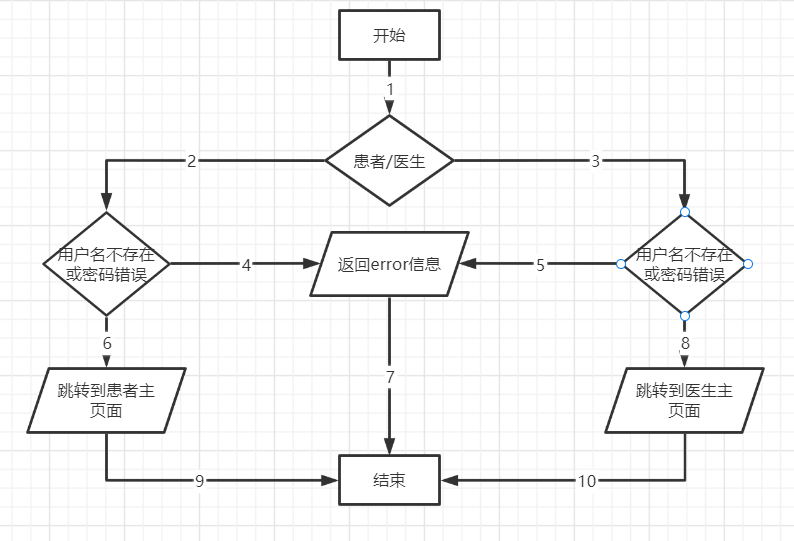

#  **HMS** **医院门诊预约系统**

 

**[** **部署文档]**

 

| 成员 | 杨宏飞 |
| ---- | ------ |
| 成员 | 赵子璁 |
| 成员 | 陶佑鹏 |
| 成员 | 孙宇航 |
| 成员 | 张昊然 |

- [**HMS医院门诊预约系统**](#**医院门诊预约系统**)
- [1.  概述](#1--概述)
  - [1.1   项目背景](#11---项目背景)
  - [1.2   编写目的](#12---编写目的)
  - [1.3   涉及名词解释](#13---涉及名词解释)
  - [1.4 参考资料](#14-参考资料)
  - [1.5 相关文档](#15-相关文档)
- [2. 系统需求信息](#2-系统需求信息)
  - [2.1 目标系统功能需求](#21-目标系统功能需求)
  - [2.2 目标系统性能需求](#22-目标系统性能需求)
  - [2.3 目标系统接口需求](#23--目标系统接口需求)
- [3. 功能测试报告](#3-功能测试报告)
  - [3.1 测试环境](#31-测试环境)
    - [3.1.1.硬件环境](#331硬件环境)
    - [3.1.2.软件测试环境](#332软件测试环境)
  - [3.2 单元测试](#32-单元测试)
  - [3.3.集成测试](#33集成测试)
  - [3.3.功能测试](#33功能测试)
- [4.系统测试报告](#4系统测试报告)
  - [4.1.性能测试](#41性能测试)
  - [4.2.其他测试](#42其他测试)
- [5.测试结论](#5测试结论)


# 1.概述

## 1.1项目背景

随着社会的发展和人口的增长，医疗需求日益增加，导致了医院门诊人流量大，排队时间长，挂号难等问题，给医院和患者带来了不便和困扰。与此同时，互联网技术的普及与发展，人们对网上挂号的期待也愈发提高。
为了解决以上问题，方便患者预约医院的门诊号，同时减轻医院工作人员的工作量，本公司决定开发一个线上的医院门诊预约系统。这个系统旨在替换传统的当场取号和电话预约，让患者能在线上提前预约门诊号，同时方便医生查看当日的患者信息，也便于医院安排门诊排班。
## 1.2 编写目的

本文档为HMS医院门诊预约网站的测试报告，包括对本系统的性能测试以及功能上各级别的测试，编写目的是在合并以及最终的上线前进行全面的内部测试，以免出现上线出现问题以致的展示出错等状况。

## 1.3 涉及名词解释
本项目（本系统、本网站、HMS医院门诊预约系统）：代表此项目最终的成品。

## 1.4参考资料
[1] 吕云翔.软件工程：理论与实践[M].北京：人民邮电出版社，2018.

## 1.5相关文档
[1] “HMS医院门诊预约系统”的《软件开发计划书》。
[2] “HMS医院门诊预约系统”的《需求规格说明书》。
[3] “HMS医院门诊预约系统”的《软件设计说明书》。
[4] “HMS医院门诊预约系统”的《部署文档》。
[5] “HMS医院门诊预约系统”的《用户使用说明书》。

# 2. 系统需求信息

## 2.1目标系统功能需求

参见“HMS医院门诊预约系统”的《需求规格说明书》

## 2.2目标系统性能需求

参见“HMS医院门诊预约系统”的《需求规格说明书》

## 2.3目标系统接口需求

参见“HMS医院门诊预约系统”的《需求规格说明书》

# 3. 功能测试报告

## 3.1 测试环境

### 3.1.1 硬性环境

处理器：11th Gen Intel(R) Core(TM) i7-11800H @ 2.30GHz   2.30 GHz
内存： 16GB
硬盘容量：1TB
输入输出设备：鼠标、键盘、显示屏
网络设备：宽带

### 3.1.1 软件测试环境

操作系统为Windows 10，使用集成开发环境PyCharm，数据库采用MySQL，后端采用Django 3.2，项目运行环境为Python3.8。
其他开发工具包括：WebStorm等。
云服务器：腾讯云

## 3.2 单元测试

### 3.2.1测试描述

对于本系统的单元测试，主要针对前后端交互功能的实现以及交互逻辑的判断。我们在测试过程中采取的方法为白盒测试。接下来将详细展现用户登录模块的测试逻辑。先画出流程图，再基于代码设计测试用例并绘制出测试分支覆盖表如3.2.2中所示。

### 3.2.2白盒测试过程

前端的源码部分如下：

``` javascript
const uid = ref('P00000000000');
const password = ref('newpassword');
const options = ref(['患者身份进入', '非患者身份进入']);
const is_patient = ref('off');
const role = ref('patient')//判断是不是患者
//用于判断登录是否成功的变量
const juglog = ref(0);
function loginbt() {
    //首先判断是不是患者
    if (is_patient.value === '患者身份进入') role.value = 'patient';
    else role.value = 'doctor';
    console.log(role.value);
    if (role.value == 'patient') {
        axios.post('http://121.199.161.134:8080/loginPatient',null, {
            params: {
                uid: uid.value,
                password: password.value,
            }}
        )
            .then(response => {
                console.log(response.data.code);
                //传送成功的情况下，判断信息是否正确
                const jud =response.data.code;
                console.log(response.data.data);
                if(jud == 1){
                    console.log(response.data);
                    sessionStorage.setItem('token', response.data.data);
                    sessionStorage.setItem('role', role.value);//y是患者，n是医生
                    juglog.value = 1;
                    window.location.href="/patientRoot";
                }
                //将将返回的token存到session中
                else if(jud == 2){

                    sessionStorage.setItem('token', response.data.data);
                    sessionStorage.setItem('role', role.value);//y是患者，n是医生
                    juglog.value = 1;
                    window.location.href="/managerEnter";
                }
                else{
                    console.log('登录失败');
                    juglog.value = -1;
                }
            })
            .catch(error => {
                console.error(error)
                judlog.value = -1;
            })
    }
    if (role.value == 'doctor') {
        axios.post('http://121.199.161.134:8080/loginDoctor',null,{params: {
                uid: uid.value,
                password: password.value,
            }}
        )
            .then(response => {
                console.log(response.data.code);
                //传送成功的情况下，判断信息是否正确
                const jud =response.data.code;
                console.log(typeof(jud));
                if(jud == 1){
                    sessionStorage.setItem('token', response.data.data);
                    sessionStorage.setItem('role', role.value);//y是患者，n是医生
                    juglog.value = 1;
                    window.location.href="/doctorRoot";
                }
                //将将返回的token存到session中
                else if(jud == 2){
                    sessionStorage.setItem('token', response.data.data);
                    sessionStorage.setItem('role', role.value);//y是患者，n是医生
                    juglog.value = 1;
                    console.log(sessionStorage.getItem('token'));
                    window.location.href="/defaultView";
                }
                else{
                    console.log('登录失败');
                    juglog.value = -1;
                }
            })
            .catch(error => {
                console.error(error)
                judlog.value = -1;
            })
    }

}
```

流程图如图2所示：

<center>图2白盒测试流程图</center>

测试用例与分支覆盖表如表1所示：
<center> 表1 测试用例与分支覆盖表 

| 输入 | 执行路径 |
|------|----------|
|患者， “123”,“123” | 1,2,4,7 |
|患者，“”,“” | 1,2,4,7 |
|患者， “luanbu1”，“dengfenglai.” | 1,2,6,9 |
|患者， “luanbu2”，“dengfenglai.” | 1,2,6,9 |
|医生， “123”,“123” | 1,3,5,7 |
|医生，“”,“” | 1,3,5,7 |
|医生， “luanbu1”，“dengfenglai.” | 1,3,8,10 |
|医生， “luanbu2”，“dengfenglai.” | 1,3,8,10 |
此时数据库中已经有患者用户“luanbu1”“luanbu2”，密码均为“dengfenglai.”，也有医生用户“luanbu1”“luanbu2”，密码均为“dengfenglai.”
没有用户“123”，也不允许用户名为空。

### 3.2.3测试结果

登录模块测试的几个样例全部通过，说明没有在用户登录模块中检测出错误。在其他部分的单元测试阶段完成后，发现主要bug集中于预约的一些数据不同步。在修复完bug后，全部模块测试正常，单元测试进行完毕。

## 3.3 集成测试

### 3.3.1测试描述

集成测试又称组装测试，是在单元测试的基础上，将所有模块按照设计要求组装成子系统或系统进行的测试活动。目的是确保各单元组合在一起后能够按既定意图协作运行，并确保增量的行为正确。
我们要测试所有的公共接口，尤其是那些与系统相关联的外部接口，故本项目的测试重点是测试页面间的跳转是否正确，测试是否存在跳转到不正确页面的情况。

### 3.3.2测试结果

通过集成测试，我们发现系统的各个页面都能通过导航链接跳转到对应的页面，页面间传递的参数均是正确的，集成测试通过。

## 3.4功能测试

### 3.4.1测试描述

按照《需求规格说明书》和《软件设计说明书》中的功能模块设计，为系统的各项功能合集了测试方案。我们给出了相应的测试用例和测试结果，并记录了测试输入、测试输出以及测试结果。

### 3.4.2测试结果

“注册”模块的测试如表2所示：

<center> 表2 “注册”模块测试</center>

| 用例编号 | 101 |
| -------- | --- |
| 功能名称 | 注册 |
| 前置条件 | 无 |
| 后置条件 | 无 |
| 活动步骤 | 1. 用户在注册页面填写新注册账号的信息<br>2. 用户填完信息之后点击提交按钮<br>3. 系统检查是否重复注册或是注册信息不合法<br>4. 系统将新注册用户信息存入数据库 |
| 测试输入 | 输入邮箱以及自定义的用户名和密码 |
| 测试输出 | 注册成功跳转到登录页面；失败提示失败消息 |
| 测试结果 | 通过 |
| 发现问题 | 无 |

“登录”模块的测试如表3所示：

<center>表3 “登录”模块测试</center>

| 用例编号 | 102 |
| -------- | --- |
| 功能名称 | 登录 |
| 前置条件 | 无 |
| 后置条件 | 跳转到已登录情况 |
| 活动步骤 | 1. 用户在登录页面填写用户名和密码<br>2. 用户填完信息之后点击登录按钮<br>3. 系统检查信息是否正确<br>4. 用户信息更新为已登录 |
| 测试输入 | 输入用户名和密码 |
| 测试输出 | 登录成功跳转到视频总页；失败提示失败消息 |
| 测试结果 | 通过 |
| 发现问题 | 无 |

“找回密码”模块的测试如表4所示：
<center>表4 “找回密码”模块测试</center>

| 用例编号 | 103 |
| -------- | --- |
| 功能名称 | 找回密码 |
| 前置条件 | 无 |
| 后置条件 | 修改用户密码 |
| 活动步骤 | 1. 用户登录时点击忘记密码按钮<br>2. 系统跳转到忘记密码的页面 <br>3.用户输入邮箱并进行验证<br>4.用户进行密码修改<br>5.系统通过密码修改|
| 测试输入 | 邮箱与新密码 |
| 测试输出 | 修改成功信息 |
| 测试结果 | 通过 |
| 发现问题 | 无 |

“编辑个人资料”模块的测试如表5所示：

<center>表5 “编辑个人资料”模块测试</center>

| 用例编号 | 201 |
| -------- | --- |
| 功能名称 | 编辑个人资料 |
| 前置条件 | 已登录状态 |
| 后置条件 | 更新用户个人信息 |
| 活动步骤 | 1. 用户可以填写新个人信息<br>2. 点击确认按钮，更新数据库中的对应信息 |
| 测试输入 | 输入新的个人信息 |
| 测试输出 | 更新成功的信息提示 |
| 测试结果 | 通过 |
| 发现问题 | 无 |

“查看消息通知”模块的测试如表6所示：

<center>表6 “查看消息通知”模块测试</center>

| 用例编号 | 202 |
| -------- | --- |
| 功能名称 | 查看消息通知 |
| 前置条件 | 已登录状态 |
| 后置条件 | 无 |
| 活动步骤 | 1. 用户可以查看个人的消息通知<br>2. 系统展示用户的消息通知 |
| 测试输入 | 点击消息通知按钮 |
| 测试输出 | 进入消息通知页面 |
| 测试结果 | 通过 |
| 发现问题 | 无 |

“退出登录”模块的测试如表7所示：

<center>表7 “退出登录”模块测试</center>

| 用例编号 | 203 |
| -------- | --- |
| 功能名称 | 退出登录 |
| 前置条件 | 已登录状态 |
| 后置条件 | 跳转到游客状态 |
| 活动步骤 | 1. 用户登录时点击退出登录按钮<br>2. 系统改变用户登录状态并跳转到登录界面 |
| 测试输入 | 点击退出登录按钮 |
| 测试输出 | 退出结果的信息提示 |
| 测试结果 | 通过 |
| 发现问题 | 无 |

“账号注销”模块的测试如表8所示：

<center>表8 “账号注销”模块测试</center>

| 用例编号 | 204 |
| -------- | --- |
| 功能名称 | 账号注销 |
| 前置条件 | 已登录状态 |
| 后置条件 | 删除用户账号并跳转到登陆界面 |
| 活动步骤 | 1. 用户登录时注销账号按钮<br>2.系统弹窗提醒 3.系统删除用户账号并跳转到登录界面 |
| 测试输入 | 点击注销账号按钮 |
| 测试输出 | 注销成功的信息提示 |
| 测试结果 | 通过 |
| 发现问题 | 无 |

“查看本周排班”模块的测试如表9所示：
<center>表9 “查看本周排班”模块测试</center>

| 用例编号 | 301 |
| -------- | --- |
| 功能名称 | 查看本周排班 |
| 前置条件 | 已登录医生端 |
| 后置条件 | 展示用户的排班列表 |
| 活动步骤 | 1. 用户可以查看个人的本周排班<br>2. 系统展示用户的排班列表 |
| 测试输入 | 点击本周排班按钮 |
| 测试输出 | 展示排班列表组件 |
| 测试结果 | 通过 |
| 发现问题 | 无 |

“查看候诊列表”模块的测试如表10所示：
<center>表10 “查看候诊列表”模块测试</center>

| 用例编号 | 302 |
| -------- | --- |
| 功能名称 | 查看候诊列表 |
| 前置条件 | 已登录医生端 |
| 后置条件 | 展示今日候诊列表 |
| 活动步骤 | 1. 用户可以查看个人的今日候诊列表<br>2. 系统展示用户的预约列表 |
| 测试输入 | 点击今日候诊按钮 |
| 测试输出 | 展示今日候诊列表组件 |
| 测试结果 | 通过 |
| 发现问题 | 无 |

“确认完成预约”模块的测试如表11所示：
<center>表11 “确认完成预约”模块测试</center>

| 用例编号 | 303 |
| -------- | --- |
| 功能名称 | 确认完成预约 |
| 前置条件 | 已登录医生端 |
| 后置条件 | 更改按钮字样 |
| 活动步骤 | 1. 用户点击未完成按钮<br>2. 系统接收到预约完成信息<br>3.系统更改未完成按钮字样为“已完成” |
| 测试输入 | 点击未完成按钮 |
| 测试输出 | 预约的信息提示|
| 测试结果 | 通过 |
| 发现问题 | 无 |

“查看患者信息”模块的测试如表12所示：
<center>表12 “查看患者信息”模块测试</center>

| 用例编号 | 304 |
| -------- | --- |
| 功能名称 | 查看患者信息 |
| 前置条件 | 已登录医生端 |
| 后置条件 | 跳转至患者信息界面 |
| 活动步骤 |1、点击患者信息按钮<br>2、跳转至患者个人信息页面 |
| 测试输入 | 点击患者信息按钮 |
| 测试输出 | 跳转至患者个人信息页面|
| 测试结果 | 通过 |
| 发现问题 | 无 |

“查找医生”模块的测试如表13所示：
<center>表13 “查找医生”模块测试</center>

| 用例编号 | 401 |
| -------- | --- |
| 功能名称 | 查找医生 |
| 前置条件 | 已登录患者端 |
| 后置条件 | 展示医生列表 |
| 活动步骤 | 1. 用户在主界面点击查找医生按钮<br>2.系统跳转至查询界面  <br>3. 用户选择两级科室<br>4.系统查询科室中的医生信息 <br> 4. 系统显示符合条件的医生列表 |
| 测试输入 | 点击查找医生按钮 |
| 测试输出 | 符合条件的医生列表 |
| 测试结果 | 通过 |
| 发现问题 | 无 |

“查看医生信息”模块的测试如表14所示：
<center>表14 “查看医生信息”模块测试</center>

| 用例编号 | 402 |
| -------- | --- |
| 功能名称 | 查看医生信息 |
| 前置条件 | 已登录患者端 |
| 后置条件 | 显示医生信息 |
| 活动步骤 | 1.用户从医生列表中选择一个医生；<br>2. 系统显示医生的详细信息。 |
| 测试输入 | 点击医生图标 |
| 测试输出 | 医生详细信息 |
| 测试结果 | 通过 |
| 发现问题 | 无 |

“查找空闲医生”模块的测试如表15所示：
<center>表15 “查找空闲医生”模块测试</center>

| 用例编号 | 403 |
| -------- | --- |
| 功能名称 | 查找空闲医生 |
| 前置条件 | 已登录患者端 |
| 后置条件 | 展示医生列表 |
| 活动步骤 |  1.用户在主界面点击“查看医生信息”，进入查询界面<br>  2. 用户选择两级科室和日期 <br> 3. 系统查询科室中的医生信息<br>  4. 系统显示符合条件的医生列表 |
| 测试输入 | 点击查找医生按钮 |
| 测试输出 | 符合条件的医生列表 |
| 测试结果 | 通过 |
| 发现问题 | 无 |

“查看医生空闲时间段”模块的测试如表16所示：
<center>表16 “查看医生空闲时间段”模块测试</center>

| 用例编号 | 404 |
| -------- | --- |
| 功能名称 | 查看医生空闲时间段 |
| 前置条件 | 已登录患者端 |
| 后置条件 | 展示医生信息和空闲时间段 |
| 活动步骤 |  1.用户从空闲医生列表中选择一个医生；<br>2. 系统显示医生的信息和空闲时间段 |
| 测试输入 | 点击医生图标 |
| 测试输出 | 医生信息和空闲时间段 |
| 测试结果 | 通过 |
| 发现问题 | 无 |

“预约挂号”模块的测试如表17所示：
<center>表17 “预约挂号”模块测试</center>

| 用例编号 | 405 |
| -------- | --- |
| 功能名称 | 预约挂号 |
| 前置条件 | 已登录患者端 |
| 后置条件 | 返回预约成功或失败信息 |
| 活动步骤 |  1. 用户点击医生的可预约时间段；<br>2. 用户确认预约信息；<br>3. 系统处理预约请求，返回预约成功或失败信息。如果如果选择的预约时间段已被其他患者预约，系统提示选择其他时间段。|
| 测试输入 | 点击可预约时间段|
| 测试输出 | 返回预约成功或失败信息 |
| 测试结果 | 通过 |
| 发现问题 | 无 |

“查看预约信息”模块的测试如表18所示：
<center>表18 “查看预约信息”模块测试</center>

| 用例编号 | 501 |
| -------- | --- |
| 功能名称 | 查看预约信息 |
| 前置条件 | 已登录患者端 |
| 后置条件 | 显示预约信息列表 |
| 活动步骤 | 1. 用户请求查看预约信息；<br>2. 系统检索并返回用户所有的历史预约信息。|
| 测试输入 | 点击可预约时间段|
| 测试输出 | 显示预约信息列表 |
| 测试结果 | 通过 |
| 发现问题 | 无 |

“取消预约”模块的测试如表19所示：
<center>表19 “取消预约”模块测试</center>

| 用例编号 | 502 |
| -------- | --- |
| 功能名称 | 取消预约 |
| 前置条件 | 已登录患者端 |
| 后置条件 | 返回取消成功或者失败信息 |
| 活动步骤 |1.用户请求取消就诊的预约；<br>2. 系统检查预约信息的状态，如果是待就诊状态，则执行取消操作并返回取消成功，否则返回取消失败。|
| 测试输入 | 点击取消就诊按钮|
| 测试输出 | 取消成功或者失败信息 |
| 测试结果 | 通过 |
| 发现问题 | 无 |

“修改科室信息”模块的测试如表20所示：
<center>表20 “取消预约”模块测试</center>

| 用例编号 | 601 |
| -------- | --- |
| 功能名称 | 修改科室信息 |
| 前置条件 | 已登录后台端，科室存在 |
| 后置条件 | 科室介绍文字被更改 |
| 活动步骤 | 1、管理员输入科室信息并查询原有介绍内容 <br>2、系统显示原有介绍内容 <br>3、管理员输入欲修改信息<br>4、管理员提交信息，科室信息被修改 |
| 测试输入 | 输入欲修改信息|
| 测试输出 | 返回科室信息修改提示 |
| 测试结果 | 通过 |
| 发现问题 | 无 |

“修改医生信息”模块的测试如表21所示：
<center>表21 “修改医生信息”模块测试</center>

| 用例编号 | 602 |
| -------- | --- |
| 功能名称 | 修改医生信息 |
| 前置条件 | 已登录后台端，医生存在 |
| 后置条件 | 医生个人信息被修改 |
| 活动步骤 | 1、 管理员输入医生姓名 <br>2、 系统显示所有符合要求的医生供挑选<br>3、管理员选择想要修改的医生<br>4、管理员输入修改信息<br>5、管理员提交修改信息 |
| 测试输入 | 输入修改信息|
| 测试输出 | 返回医生信息修改提示 |
| 测试结果 | 通过 |
| 发现问题 | 无 |

“信息审核”模块的测试如表22所示：
<center>表22 “信息审核”模块测试</center>

| 用例编号 | 603 |
| -------- | --- |
| 功能名称 | 信息审核 |
| 前置条件 | 已登录后台端，存在未审核信息 |
| 后置条件 | 未审核信息得到处理 |
| 活动步骤 | 1、 管理员对待审核信息详情进行查看<br>2、 管理员根据信息内容选择同意或拒绝申请 |
| 测试输入 | 点击同意或拒绝按钮|
| 测试输出 | 返回审核信息提示 |
| 测试结果 | 通过 |
| 发现问题 | 无 |

“医生排班”模块的测试如表23所示：
<center>表23 “医生排班”模块测试</center>

| 用例编号 | 604 |
| -------- | --- |
| 功能名称 | 医生排班 |
| 前置条件 | 已登录后台端，医生存在 |
| 后置条件 | 生成医生排班信息 |
| 活动步骤 | 1、管理员根据一、二级科室筛选医生<br>2、系统给出医生列表<br>2、管理员选择待排班医生<br>3、管理员根据时间表或预制模板对医生进行排班 |
| 测试输入 | 修改排班表|
| 测试输出 | 返回修改成功信息提示 |
| 测试结果 | 通过 |
| 发现问题 | 无 |


# 4.系统测试报告

## 4.1 性能测试报告

### 4.1.1并发测试

上传到服务器后进行测试：多个用户均可以并发访问网站，不会造成彼此间的冲突。达到了医院门诊预约系统的基本要求。

### 4.1.2页面响应测试

根据性能需求表来进行测试，测试结果如下表所示：

<center>表23 性能测试表格</center>

| 编号 | 性能需求来源名称 | 功能描述 | 响应要求 | 功能结果 | 测试结果 |
| ---- | ---- | ---- | ---- | ---- | ---- |
| 1    | 登录/注册的响应时间（检验账号存在性） | 在登录注册页面填写账号后，检验是否合法 | 0.5秒 | 显示账号是否合法的结果 | 0.2秒通过 |
| 2    | 个人主页响应时间 | 加载个人信息页面 | 0.5秒 | 得到个人信息的详情页 | 0.3秒以内通过 |
| 3    |  消息通知页面响应时间 | 0.5秒 | 得到消息通知详情页面 | 0.3秒 |
| 4    | 搜索医生 | 对本医院进行搜索，查询符合条件的医生| 1秒 | 按条目展示符合条件的医生 | 0.5秒内通过 |
| 5    | 点击预约按钮/取消按钮/未完成按钮等和预约功能相关的响应时间 | 用户在通过这些按钮对预约记录进行操作 | 1秒 | 将相应的记录存储于云端 | 0.5秒通过 |

## 4.2其他测试报告

### 4.2.1内容测试

使用不同的方法打开页面，刷新页面后，页面的内容展示均没有发生变化，css均在原定位置展示信息。
通过查看后端服务器和数据库数据，发现前端的数据与后端从服务器中查询的json数据一致。同时验证由前端打包的json文件与后端所接受的json文件一致。

### 4.2.2用户界面测试

我们将ui设计得尽量简洁实用，并通过多次尝试更好地展现网站的内容，做到符合需求分析时的设想。
另一方面，我们的小组成员也代入体验了一下网站用户的感受，给出了一些有建设性的建议，前端开发人员根据反馈更好地调整了用户界面。

### 4.2.3安全性测试

首先，通过在前端的测试发现，我们的代码并不会直接暴露于用户眼前。
同时在用户认证安全方面，我们明确地区分了常规用户和管理员的权限，避免系统因为权限的不同而出现混乱。
另外，由于前后端都部署在了腾讯云的服务器上，常规的攻击手段很难影响到服务器。至此，安全性测试结束。

### 4.2.4可移植性测试

经过小组多人电脑的本地测试，本项目通过webstorm软件的运行在不同电脑上均可正常展示，页面的适配也没有出现问题，支持Edge、Chrome等主流浏览器。

# 5. 测试结论

测试完成日期：2023-06-05
测试地点：学校
测试环境：家用环境
测试用具：搭载win10操作系统的笔记本电脑
参与测试人员：小组全体成员
系统的强项：页面设计清晰简洁、功能较为完善
系统的弱项：无
不符合项的统计结果：无