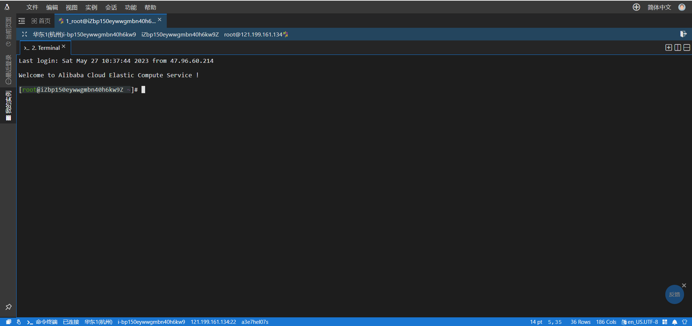
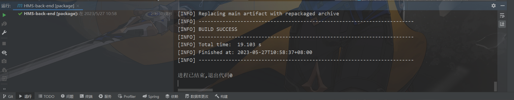
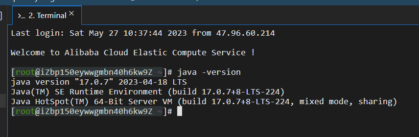
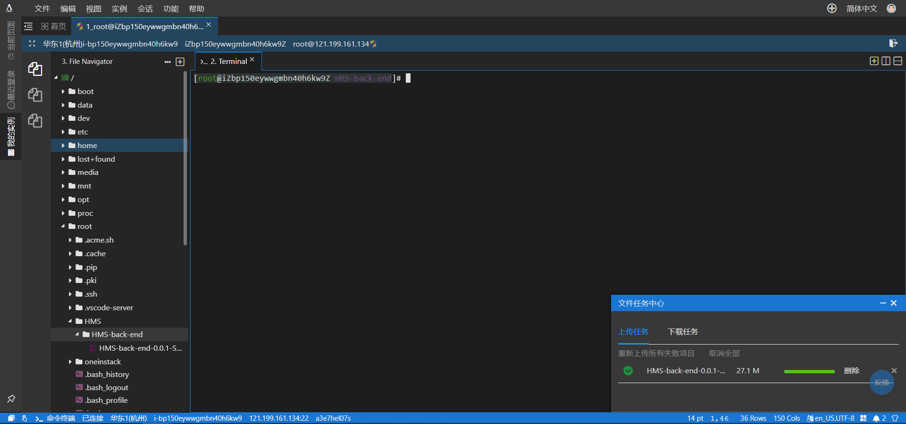
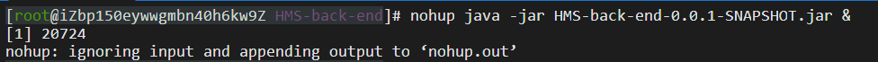
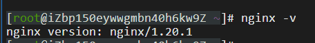
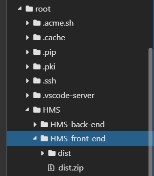
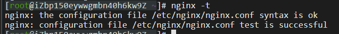
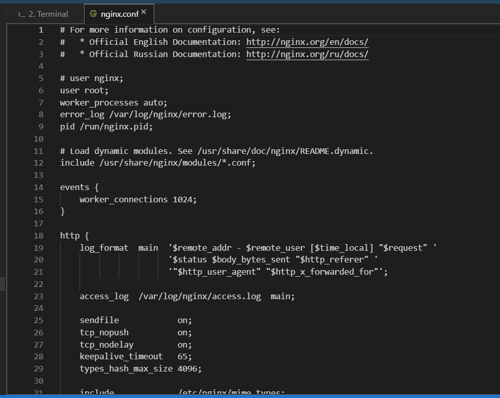
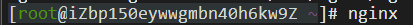

#  **HMS** **医院门诊预约系统**

 

**[** **部署文档]**

 

| 成员 | 杨宏飞 |
| ---- | ------ |
| 成员 | 赵子璁 |
| 成员 | 陶佑鹏 |
| 成员 | 孙宇航 |
| 成员 | 张昊然 |

 

 

 

 

 

 

 

 


# 1. 部署说明

本组为“HMS医院门诊预约系统”租赁了一个云服务器与一个数据库，故采用云端部署的形式运行项目。

# 2. 部署环境要求

## 2.1 后端服务器

(1) 操作系统： CentOS 7.9 64位

(2) CPU &内存：1核(vCPU) 2 GiB

(3) 处理器型号：AMD或Intel 1.6GHz以上

(4) 带宽：1Mbps

(5) 内存要求：256MB及以上

(6) java版本：jdk-17_linux-x64

(7) springboot版本：3.0.5及以上

## 2.2 前端服务器

(1) 操作系统：CentOS 7.9 64位

(2) CPU&内存：1核(vCPU) 2 GiB

(3) 处理器型号：AMD或Intel 1.6GHz以上

(4) 带宽：1Mbps

(5) 内存要求：256MB及以上

(6) Nginx版本：1.18.0及以上

(7) Nodejs版本：10.19.0及以上

(8) npm版本：6.14.4及以上


 

## 2.3 数据库

(1) 数据库版本：MySQL 8.0以上

(2) CPU：1核

(3) 数据库内存：1GB

(4) 最大连接数：2000

(5) 最大IOPS：10000

# 3. 后端部署步骤

## 3.1 连接云服务器

在阿里云云服务器管理控制台连接阿里云服务器。打开页面后，点击远程连接选择通过Workbench远程连接，按要求输入用户名和密码后点击连接。连接成功后会自动跳转至如图1所示界面：



<center>图 1 连接成功界面</center>


## 3.2 下载项目与准备运行环境

首先将后端springboot项目打包, 成功输出如图2.



<center>图 2 打包成功输出结果</center>

然后准备运行环境，使用终端下载jdk。

操作流程如下：

```shell
# 用wget命令在 /opt 目录下下载 *.tar.gz压缩包
cd /opt
wget https://download.oracle.com/java/17/latest/jdk-17_linux-x64_bin.tar.gz

# 解压tar.gz压缩包：
tar -zxvf jdk-17_linux-x64_bin.tar.gz 
# 将jdk-17.0.1改名为java17
mv jdk-17.0.1 java17
# 删除没用的压缩包
rm -rf jdk-17_linux-x64_bin.tar.gz 

# 配置环境变量
# 进入profile文件，按i进入编辑模式
vim /etc/profile
# 在文件最下方添加
export JAVA_HOME=/opt/java17
export PATH=$PATH:$JAVA_HOME/bin;
export CLASSPATH=.:$JAVA_HOME/lib/dt.jar:$JAVA_HOME/lib/tools.jar;
```




<center>图 3 安装成功</center>

下载完毕后，在终端界面点击文件->打开新文件树，在任意位置创建目录作为项目的根目录，将打包好的springboot项目上传至根目录。



<center>图 4 上传成功</center>

这时服务器端的配置基本已经完成。本项目还需要连接一个远程MySQL数据库，数据库的配置文件已经写入到了application.yml文件中，不需要手动修改。

至此项目的后端服务器配置已经完成。

## 3.3 启动项目

在项目目录中，输入图5中命令，看到输出提示后，就说明项目启动成功。



<center>图5 启动成功页面</center>

至此，后端已经成功部署到服务器。


# 4. 前端部署步骤

## 4.1 连接云服务器

在阿里云云服务器管理控制台连接阿里云服务器。打开页面后，点击远程连接选择通过Workbench远程连接，按要求输入用户名和密码后点击连接。连接成功后会自动跳转至如图1所示界面：


<center>图 6 连接成功界面</center>

## 4.2 安装Nginx

在云服务器上安装Nginx，输入如下命令即可安装。

```shell
yum install -y nginx
```



<center>图 7 Nginx安装成功</center>

## 4.3 上传项目

将云服务器切换到想要放置项目文件的目录下，将vue文件打包生成dist文件夹，将dist文件夹上传至服务器。



<center>图 8 将前端项目上传至服务器</center>

## 4.4 配置Nginx

使用图9所示的命令找到Nginx配置文件的路径：



<center>图 9 寻找Nginx配置文件路径</center>

接下来，打开该路径下的Nginx配置文件，更改user为root，端口为前端对应端口，这里使用8081。



<center>图 10 Nginx配置文件</center>

## 4.5 启动Nginx

通过以下命令启动Nginx：



<center>图 11 启动Nginx</center>

至此，前端的部署已经完成，可以通过浏览器访问服务器来测试部署是否成功。

# 5 访问方式
目前本项目前端、后端均已部署至服务器，可通过访问以下网址进入网站：
http://121.199.161.134:8081