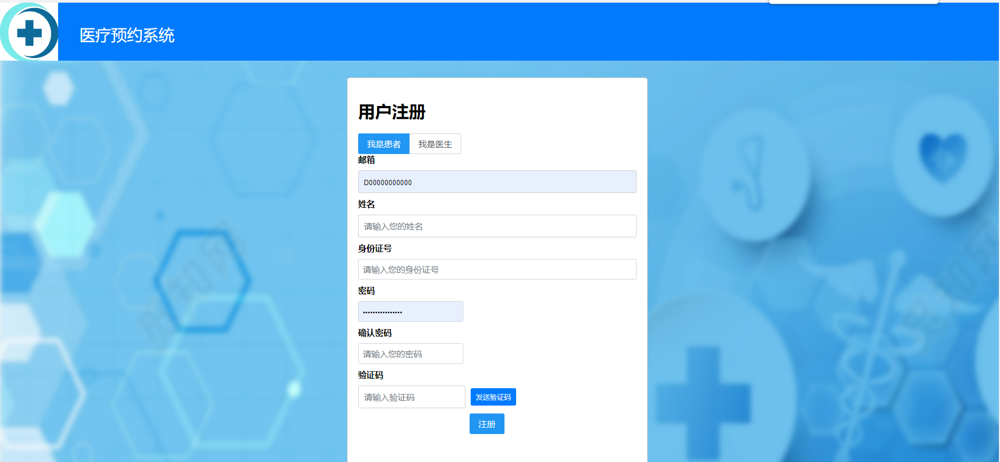
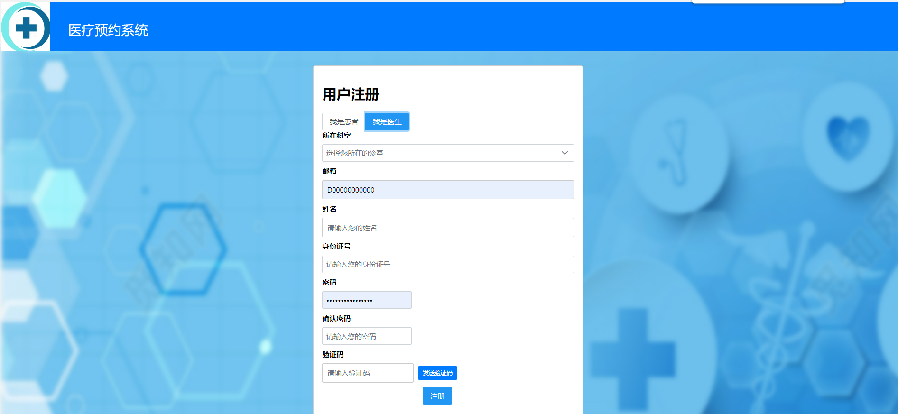
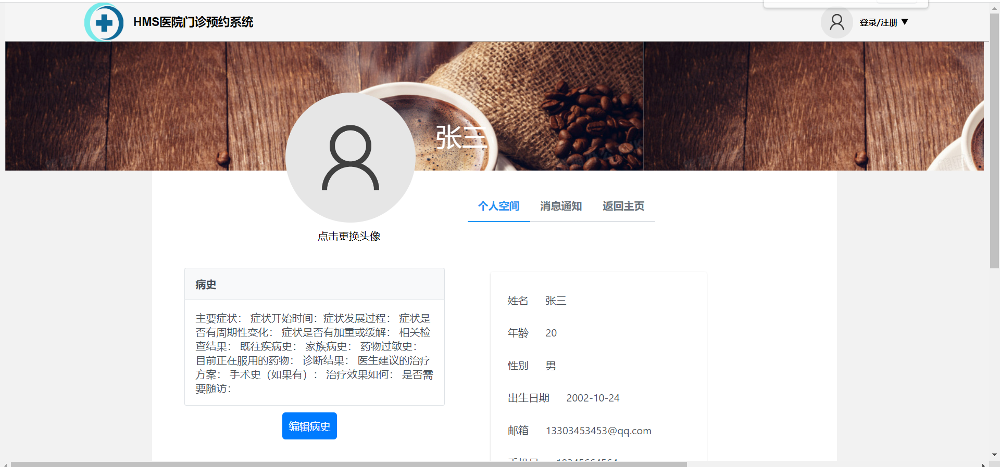

# 1. 概述

## 1.1 项目背景

近些年来，随着互联网的不断的发展，传统的预约挂号逐渐被线上的预约系统所替代。人们更希望通过线上这种更加方便的快捷的方式，来实现自己医院预约挂号的需求。通过这种线上的方式，患者能够更加清晰的看到医生的有关信息，并且足不出户就可以实现挂号。所以面对这种社会的趋势，我们制作了"HMS医院门诊预约系统"，我们致力于尽可能的使得用户可以更加的便捷的预约到自己想要预约的医生，并且在时间不冲突的情况下，尽可能的满足更多的患者的需求，使得更多的患者的疾病可以得到医治。

## 1.2 编写目的

本文档为“HMS医院门诊预约系统”平台的用户使用说明，是为了让大家更好地使用我们的网站，希望大家通过阅读这篇《用户使用说明书》，能够比较好地运用本网站，从而能够驱除疾病，早日康复。

为了更加的形象的介绍本网站的使用，我们将会在后面的内容中配合相关的截图，使得用户可以更加直观的了解本网站的使用。

## 1.3 涉及名词解释

本平台（本系统、本项目、本网站、HMS医院门诊预约系统）：代表此项目最终的成品。

## 1.4 项目使用者

本项目的使用者为有预约挂号需求的患者，和医院的医生。

## 1. 5 参考资料

[1] 吕云翔.软件工程：理论与实践[M].北京：人民邮电出版社，2018.

## 1.6 相关文档

[1] “HMS医院门诊预约系统”的《软件开发计划书》。

[2] “HMS医院门诊预约系统”的《需求规格说明书》。

[3] “HMS医院门诊预约系统”的《软件设计说明书》。

[4] “HMS医院门诊预约系统”的《部署文档》。

[5] “HMS医院门诊预约系统”的《用户使用说明书》。

# 2. 软件概述

## 2.1 项目目标

以实现所有基础需求为保证、以进一步提高用户体验为拓展，我们提出以下目标：

\1. 保证平台基础功能的正常运行。

\2. 保证平台信息的私密性和安全性。

\3. 保证平台操作的便利性和流畅性。

\4. 适当拓展额外功能与特性，已给用户提供更全面、更个性化的服务。

\5.保证本平台的公平性，使得患者能公平的抢到票。

## 2.2 子系统介绍

本项目的子系统设置见表1子系统清单列表：

***\*表1\**** ***\*子系统清单列表\****

| 编号 | 名称           | 功能描述                                                     |
| ---- | -------------- | ------------------------------------------------------------ |
| 1    | 登录注册子系统 | 1. 游客可以进行注册。 2. 注册用户可以登录系统，查看、修改个人信息，重置密码，登出系统。 |
| 2    | 个人主页子系统 | 1. 用户可以查看自己的个人信息,并对个人信息进行修改。 2.医生可以查看并编辑自己的个人简历 。 3. 患者可以查看并编辑自己的个人病史。 4.后台会审核修改的信息。 |
| 3    | 消息通知子系统 | 1. 用户可以查看自己账号的消息。                              |
| 4    | 医生排班子系统 | 1. 医生可以查看自己的当天的预约情况以及预约患者的信息。 2.医生可以查看自己的最近一周的预约的情况 |
| 5    | 患者预约子系统 | 1. 患者可以的选择自己想要预约的医生，并且选择预约的具体时间。 |
| 6    | 后台子系统     | 1. 对于用户的信息进行审核 2.对于排班进行管理              |

 

## 2.3 功能模块介绍

本项目的功能模块见表2：

***\*表2\**** ***\*功能模块\****

| 编号 | 名称             | 模块功能描述                             |
| ---- | ---------------- | ---------------------------------------- |
| 101  | 注册             | 游客通过注册称为已登录用户               |
| 102  | 登录             | 未登录用户通过登录成为已登录用户         |
| 103  | 退出登录         | 已登录用户退出登录                       |
| 104  | 注销账号         | 已登录用户注销账号                       |
| 105  | 找回账号         | 未登录用户通过个人信息找回账号           |
| 201  | 编辑个人资料     | 已登录用户编辑个人资料                   |
| 202  | 患者编辑个人病史 | 已登录患者编辑个人病史                   |
| 203  | 医生编辑个人简历 | 已登录医生编辑个人简历                   |
| 301  | 用户查看个人消息 | 已登录查看自己的消息                     |
| 401  | 医生查看候诊信息 | 已登录的医生查看自己的今日的候诊情况     |
| 402  | 医生查看排班信息 | 已登录的医生查看自己的最近一周的排班情况 |
| 501  | 患者预约挂号     | 已登录的患者进行预约挂号                 |
|      |                  |                                          |
|      |                  |                                          |
|      |                  |                                          |
|      |                  |                                          |
|      |                  |                                          |
|      |                  |                                          |
|      |                  |                                          |
|      |                  |                                          |
|      |                  |                                          |
|      |                  |                                          |
|      |                  |                                          |
|      |                  |                                          |
|      |                  |                                          |
|      |                  |                                          |
|      |                  |                                          |

## 2.4 性能介绍

本系统主要的性能介绍见表3：

***\*表3\**** ***\*主要性能表\****

| ***\*编号\**** | ***\*性能需求来源名称\**** | ***\*使用者\**** | ***\*功能描述\****                                           | ***\*响应要求\**** | ***\*结果\****                           |
| -------------- | -------------------------- | ---------------- | ------------------------------------------------------------ | ------------------ | ---------------------------------------- |
| 1              | 检验账号存在性             | 游客             | 在登录注册页面填写账号后，检验账号是否已注册                 | 0.5 秒             | 显示账号是否已注册                       |
| 2              | 构建医生的排班表           | 医生用户         | 在患者进行预约之后会对医生的排班表进行更新，以供医生查看     | 1 秒               | 获取医生的排班表，访问医生端主页时将显示 |
| 3              | 加载网站页面               | 游客             | 加载预约系统平台的页面                                       | 0.5 秒             | 显示平台的页面                           |
| 4              | 提供可预约的医生以及时间段 | 患者用户         | 实时的对不同的医生的可以预约的时间段进行更新，使得患者可以明确每个医生的可预约挂号的时间段 | 1秒                | 按条目展示搜索结果                       |

# 3. 运行环境

## 3.1 硬件运行环境

前期使用个人PC开发，个人PC的具体配置如下：

处理器：Intel® Core™ i7-8750U CPU @2.20Ghz 2.21Ghz

内存： 8GB

硬盘容量：1TB

输入输出设备：鼠标、键盘、显示屏

网络设备：宽带

## 3.2 软件运行环境

操作系统为Windows 10，使用集成开发环境IDEA，数据库采用MySQL，后端采用SpringBoot3.0.2，项目运行环境为Java17。

其他开发工具包括：vscode等。

云服务器：阿里云

# 4．系统各页面进入方式

## 4.1 本地文件进入方式

由于本项目使用Vue 3框架进行开发，并且通过CLI进行项目的创建，所以只需要在前端项目目录运行npm run serve指令，运行成功后访问http://localhost:8080即可访问本文件。

# 5．系统功能相关说明

## 5.1注册/登录

（1）登录：用户在输入用户名和密码后，并且选择自己登陆时的身份。点击登录按钮即可登录。如果输入的信息不合法或者用户名和密码不匹配，会提示错误信息。

登录页面如图1所示：

 

（2）注册：首先选择自己想要注册的身份，之后填写完成邮箱、姓名、身份证号以及邮箱对应的正确验证码等有关信息后，点击注册按钮即可注册。如果输入的信息不合法或者验证码不匹配，会提示错误信息。

注册页面如图2所示：

​														**图-患者注册**

 

​														**图-医生注册**

(3)忘记密码

忘记密码：用户忘记密码可以通过自己的邮箱找回

## 5.2患者端主页

包含内容：

搜索框--根据分类和关键词检索视频

个人主页--用户可以点击可以跳转到个人主页

分类标签—点击可以跳转到对应分类的视频展示页

视频卡片--点击可以跳转到对应的视频详情页

视频总页内容如图3所示：

 

***\*图\*******\*3\*******\*视频总页\****

 

功能介绍：

（1）搜索：点击搜索框，会出现用户的搜索历史列表和推荐（可能喜欢）的列表，用户可点击跳转到对应页面。同时可以通过输入关键词匹配到相应的视频页面。搜索功能如图4所示：

 

***\*图\*******\*4\*******\*搜索页面\****

 

（2）分类：点击分类标签的列表，可以跳转到总页对应的视频分类处。

分类如图5所示：

 

***\*图\*******\*5\*******\*分类页面\****

 

## 5.3 消息通知

 功能介绍：用户查阅自己的所有的消息

 

 

## 5.4个人主页

包含内容：

姓名标签—姓名

个人头像—头像图片

我的资料—个人信息

跳转栏—个人空间、消息通知、返回主页

病史卡片—患者个人病史的补充

跳转下拉框—跳转到个人主页、消息通知、账号注销、退出登录

 

患者个人主页如图7所示：

 

***\*图\*******\*7\**** ***\*个人主页\****

 医生个人主页如图所示

功能介绍：

（1）查看信息：

医生端：在右侧的信息卡中可以看到医生的所在诊室、邮箱等信息，左侧是医生的个人经历的简介

患者端：在右侧的信息卡中可以看到患者的手机号、邮箱等信息，左侧是患者的个人病史的介绍

 

（2）修改个人信息：

通过点击右侧的信息卡中的具体的信息项，会出现表单，用户通过表单进行信息的修改。修改完成之后点击空白处信息将会暂存，当所作的修改全部完成之后，点击保存所作的修改将会被保存，具体如下图

 

（3）医生端修改个人经历：点击页面左侧的面板下面的按钮之后，对于自己的经历的内容进行修改，修改完毕之后点击保存简历，修改将会提交后台管理员进行审核

 

 

（4）患者端修改个人病史：点击页面左侧的面板下面的按钮之后，对于自己的经历的内容进行修改，修改完毕之后点击保存病史，修改将会保存

 

 

## 5.5医生端主页

包含内容：

医生的当天的今日候诊

医生一周时间内的排版信息

 

功能介绍：

(1)查看今日的候诊状态，医生可以看到今天的各个时间段是否空闲。如果有患者候诊的话，可以看到患者姓名等个人信息、预约的时间等等。

 

 

(2)查看一整周排班信息：可以看到自己当前一整周的不同时间段的预约、门诊、休息的三种状态。

## 5.6视频播放页面

包含内容：

视频信息—标题、up主、简介

视频文件—播放存储云端的视频

操作按钮—点赞、收藏、关注up主、举报、评论

 

功能介绍：

（1） 视频的播放功能：实现了基本的播放以及调节音量、进度条、全屏等功能。

详情如图13所示：

 

***\*图\*******\*13\**** ***\*视频播放页面\****

 

（2）举报功能：可以选择对应视频的违规类型并添加相应的文字说明，详情如图14所示：

 

***\*图\*******\*14\*******\*举报页面\****

 

（3）评论功能：用户可以查看该视频下的评论并自己发表评论，详情如图15所示：

 

***\*图\*******\*15\*******\*评论页面\****